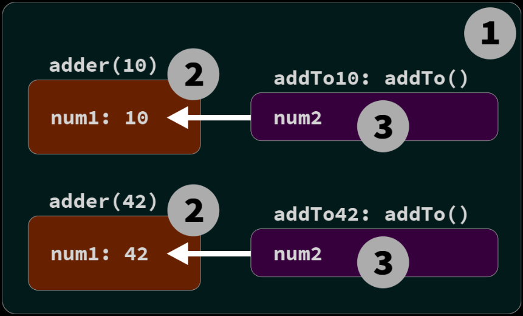
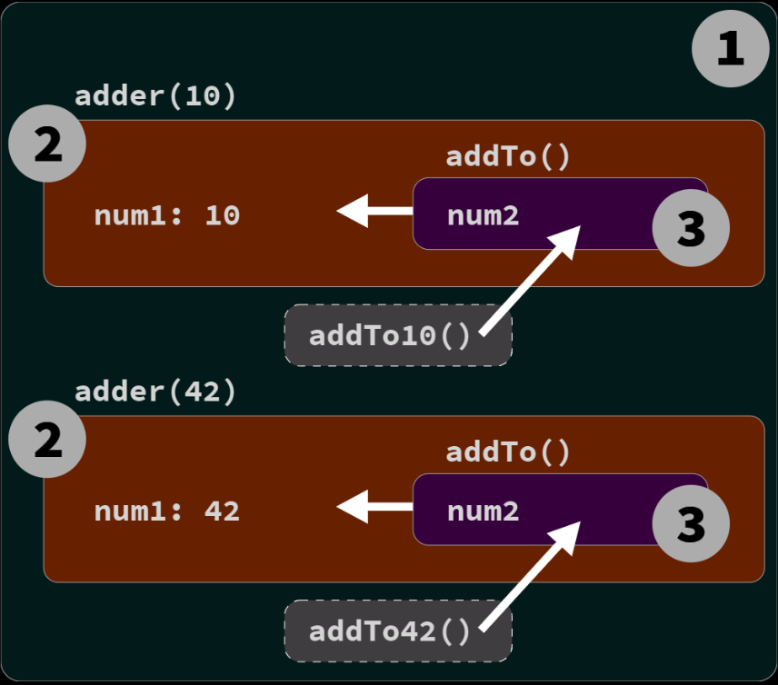

# Chapter 1: What's the Scope.

JS is in fact parsed/compiled in a
separate phase before execution begins. The code author’s
decisions on where to place variables, functions, and blocks
with respect to each other are analyzed according to the rules
of scope, during the initial parsing/compilation phase.

JS functions are themselves first-class values; they can be
assigned and passed around just like numbers or strings. But
since these functions hold and access variables, they maintain
their original scope no matter where in the program the
functions are eventually executed. This is called closure.

# Compiled vs Interpreted

- Compilation is a set of steps that process the text of your code and turn
  it into a list of instructions the computer can understand.

- With interpretation the
  source code is transformed line by line; each line or statement
  is executed before immediately proceeding to processing the
  next line of the source code.

> JS ist most accurately portrayed as a compiled language

# Compiling Code

Scope is primarily determined during compilation.

In classic compiler theory, a program is processed by a com-
piler in three basic stages:

1. Tokenizing/Lexing: breaking up a string of characters
   into meaningful (to the language) chunks, called tokens.

2. Parsing: taking a stream (array) of tokens and turning
   it into a tree of nested elements

3. Code Generation: taking an AST and turning it into ex-
   ecutable code. This part varies greatly depending on the
   language

# Required: Two Phases

processing of JS programs occurs in (at least) two phases:
parsing/compilation first, then execution

There are three program characteristics you can observe to
prove this to yourself: syntax errors, early errors, and hoisting

```js
var greeting = "Hello";
console.log(greeting);
greeting = ."Hi";
// SyntaxError: unexpected token .
```

In fact, the only way the JS engine could know about the
syntax error is by the JS engine first parsing the entire
program before any of it is executed.

```js
Next, consider:
console.log("Howdy");
saySomething("Hello","Hi");
// Uncaught SyntaxError: Duplicate parameter name not
// allowed in this context
function saySomething(greeting,greeting) {
"use strict";
console.log(greeting);
}
```

> The SynthaxError here is thrown before the
> program is executed

# Hoisting

```js
function saySomething() {
	var greeting = 'Hello';
	{
		greeting = 'Howdy'; // error comes from here
		let greeting = 'Hi';
		console.log(greeting);
	}
}
saySomething();
// ReferenceError: Cannot access 'greeting' before
// initialization
```

What’s happening is that
the greeting variable for that statement belongs to the
declaration on the next line, let greeting = "Hi" , rather
than to the previous var greeting = "Hello" statement.

The only way the JS engine could know, at the line where
the error is thrown, that the next statement would declare
a block-scoped variable of the same name

This processing of scopes and declarations can
only accurately be accomplished by parsing the program
before execution.

The ReferenceError here technically comes from greeting
= "Howdy" accessing the greeting variable too early, a con-
flict referred to as the Temporal Dead Zone (TDZ). Chapter 5
will cover this in more detail.

> It’s often asserted that let and const declara-
> tions are not hoisted But this is not accurate

# Compiler Speak

how the JS engine identifies variables and determines the scopes of a
program as it is compiled.

```js
var students = [
	{ id: 14, name: 'Kyle' },
	{ id: 73, name: 'Suzy' },
	{ id: 112, name: 'Frank' },
	{ id: 6, name: 'Sarah' },
];
function getStudentName(studentID) {
	for (let student of students) {
		if (student.id == studentID) {
			return student.name;
		}
	}
}

var nextStudent = getStudentName(73);
console.log(nextStudent);
// Suzy
```

- All occurrences of variables/identi-
  fiers in a program serve in one of two “roles”: either they’re
  the target of an assignment or they’re the source of a value.

How do you know if a variable is a target? Check if there is
a value that is being assigned to it; if so, it’s a target. If not,
then the variable is a source.

# Targets

What makes a variable a target? Consider

```js
students = ['', ''];
```

there are three other target assignment operations in the
code that are perhaps less obvious. One of them:

```js
for (let student of students) {
```

Another target reference

```js
getStudentName(73);
```

And one last

```js
function getStudentName(studentID) {
```

A function declaration is a special case of a target refer-
ence. You can think of it sort of like var getStudentName
= function(studentID) , but that’s not exactly accurate.
An identifier getStudentName is declared (at compile time).

but the = function(studentID) part is also handled at
compilation; the association between getStudentName and
the function is automatically set up at the beginning of the
scope rather than waiting for an = assignment statement to
be executed.

# Sources

In `for (let student of students)` , we said that stu-
dent is a target, but students is a source reference. In the
statement `if (student.id == studentID)` , both student
and studentID are source references. student is also a
source reference in return student.name.

In `getStudentName(73)` , getStudentName is a source reference.
In console.log(nextStudent) , console is a source reference,
as is nextStudent .

> In case you were wondering, id , name , and log
> are all properties, not variable references.

# Cheating: Runtime Scope Modifications

in non-strict-mode, there
are technically still two ways to cheat this rule, modifying
a program’s scopes during runtime.

Neither of these techniques should be used. But it’s important
to be aware of them in case you run across them in some
programs.

The `eval(..)` function receives a string of code to compile
and execute on the fly during the program runtime. If that
string of code has a var or function declaration in it, those
declarations will modify the current scope that the `eval(..)`
is currently executing in:

```js
function badIdea() {
	eval("var oops = 'Ugh!';");
	console.log(oops);
}
badIdea(); // Ugh!
```

`eval(..)` modifies the scope of the `badIdea()` function at runtime.
This is bad for many reasons

```js
var badIdea = { oops: 'Ugh!' };
with (badIdea) {
	console.log(oops);
}
```

The global scope was not modified here, but badIdea was
turned into a scope at runtime rather than compile time, and
its property oops becomes a variable in that scope. Again, this
is a terrible idea, for performance and readability reasons.

> At all costs avoid `eval()` and `with`.

# Lexycal Scope

the key idea of “lexical scope” is that it’s controlled entirely by the
placement of functions, blocks, and variable declarations, in
relation to one another.

If you place a variable declaration inside a function, the
compiler handles this declaration as it’s parsing the function,
and associates that declaration with the function’s scope. If
a variable is block-scope declared `( let / const )`, then it’s
associated with the nearest enclosing { .. } block, rather
than its enclosing function (as with `var` ).

A reference (target or source role)
must be resolved as coming from one of the scopes that
are lexically available to it; otherwise the variable is said
to be “undeclared”

If the variable is not declared in the current scope, the next
outer/enclosing scope will be consulted

- compilation creates a map of all the lexical scopes
  that lays out what the program will need while it executes.

* While scopes are identified during compila-
  tion, they’re not actually created until runtime,

## Chapter 2: Illustrating Lexycal Scope

# Marbles and Buckets, and Bubbles... Oh my!

I see the scope as a landscape with piramyds where you cant access floors above you
but if you are in a superior floor you can descend without any trouble

Every time when a function or for statement is created, a floor is created inside its
brackets you can check

```js
var students = [
	{ id: 14, name: 'Kyle' },
	{ id: 73, name: 'Suzy' },
	{ id: 112, name: 'Frank' },
	{ id: 6, name: 'Sarah' },
];
function getStudentName(studentID) {
	// function scope: BLUE
	for (let student of students) {
		// loop scope: GREEN
		if (student.id == studentID) {
			return student.name;
		}
	}
}

var nextStudent = getStudentName(73);

console.log(nextStudent); // Suzy
```


The content available in a superior floor can descend, if you are in the
third floor you can desdend to the second floor and pick something
but if you are in the first floor you can ascend
you can only pick things on your current floor

1. Bubble 1 (RED) encompasses the global scope, which
   holds three identifiers/variables: students (line 1), get-
   StudentName (line 8), and nextStudent (line 16).
2. Bubble 2 (BLUE) encompasses the scope of the function
   getStudentName(..) (line 8), which holds just one
   identifier/variable: the parameter studentID (line 8).
3. Bubble 3 (GREEN) encompasses the scope of the for -
   loop (line 9), which holds just one identifier/variable:
   student (line 9).

> Technically, the parameter studentID is not ex-
> actly in the BLUE(2) scope. We’ll unwind that
> confusion in “Implied Scopes” in Appendix A.
> For now, it’s close enough to label studentID a
> BLUE(2) marble.

An expression in the RED(1) bucket only has access to RED(1)
marbles, not BLUE(2) or GREEN(3). An expression in the
BLUE(2) bucket can reference either BLUE(2) or RED(1) mar-
bles, not GREEN(3). And an expression in the GREEN(3)
bucket has access to RED(1), BLUE(2), and GREEN(3) marbles.

- Variables are declared in specific scopes

- Any variable reference that appears in the scope where
  it was declared, or appears in any deeper nested scopes,
  will be labeled a marble of that same color

- The determination of colored buckets, and the marbles
  they contain, happens during compilation

# A Conversation Among Friends

- Engine: responsible for start-to-finish compilation and
  execution of our JavaScript program.

- Compiler: one of Engine’s friends; handles all the dirty
  work of parsing and code-generation (see previous sec-
  tion).

- Scope Manager: another friend of Engine; collects and
  maintains a lookup list of all the declared variables/i-
  dentifiers, and enforces a set of rules as to how these are
  accessible to currently executing code.

```js
var students = [
	{ id: 14, name: 'Kyle' },
	{ id: 73, name: 'Suzy' },
	{ id: 112, name: 'Frank' },
	{ id: 6, name: 'Sarah' },
];
function getStudentName(studentID) {
	for (let student of students) {
		if (student.id == studentID) {
			return student.name;
		}
	}
}
var nextStudent = getStudentName(73);
console.log(nextStudent);
// Suzy
```

We typically think of that as a single statement, but that’s not
how our friend Engine sees it. In fact, JS treats these as two
distinct operations, one which Compiler will handle during
compilation, and the other which Engine will handle during
execution.

The first thing Compiler will do with this program is perform
lexing to break it down into tokens, which it will then parse
into a tree (AST).

1. Encountering var students , Compiler will ask Scope
   Manager to see if a variable named students already
   exists for that particular scope bucket. If so, Compiler
   would ignore this declaration and move on. Otherwise,
   Compiler will produce code that (at execution time) asks
   Scope Manager to create a new variable called students
   in that scope bucket.
2. Compiler then produces code for Engine to later execute,
   to handle the students = [] assignment. The code
   Engine runs will first ask Scope Manager if there is
   a variable called students accessible in the current
   scope bucket. If not, Engine keeps looking elsewhere (see
   “Nested Scope” below). Once Engine finds a variable, it
   assigns the reference of the [ .. ] array to it.

In conversational form

- `Compiler`: Hey, Scope Manager (of the global scope),
  I found a formal declaration for an identifier called
  students , ever heard of it?

- `(Global) Scope Manager`: Nope, never heard of it,
  so I just created it for you.

- `Compiler`: Hey, Scope Manager, I found a formal
  declaration for an identifier called getStudent-
  Name , ever heard of it?

- `(Global) Scope Manager`: Nope, but I just created
  it for you.

- `Compiler`: Hey, Scope Manager, getStudentName
  points to a function, so we need a new scope
  bucket.

- `(Function) Scope Manager`: Got it, here’s the
  scope bucket.

- `Compiler`: Hey, Scope Manager (of the function), I
  found a formal parameter declaration for studen-
  tID , ever heard of it?

- `(Function) Scope Manager`: Nope, but now it’s
  created in this scope.

- `Compiler`: Hey, Scope Manager (of the function),
  I found a for -loop that will need its own scope
  bucket.

The conversation is a question-and-answer exchange, where
Compiler asks the current Scope Manager if an encountered
identifier declaration has already been encountered. If “no,”
Scope Manager creates that variable in that scope. If the
answer is “yes,” then it’s effectively skipped over since there’s
nothing more for that Scope Manager to do.

Later, when it comes to execution of the program, the con-
versation will shift to Engine and Scope Manager, and might
play out like this:

- `Engine`: Hey, Scope Manager (of the global scope),
  before we begin, can you look up the identifier
  getStudentName so I can assign this function to
  it?

- `(Global)` Scope Manager: Yep, here’s the variable.

- `Engine`: Hey, Scope Manager, I found a target
  reference for students , ever heard of it?

- `(Global)` Scope Manager: Yes, it was formally
  declared for this scope, so here it is.

- `Engine`: Thanks, I’m initializing students to un-
  defined , so it’s ready to use.
  Hey, Scope Manager (of the global scope), I found
  a target reference for nextStudent , ever heard of
  it?

- `(Global)` Scope Manager: Yes, it was formally
  declared for this scope, so here it is.

- `Engine`: Thanks, I’m initializing nextStudent to
  undefined , so it’s ready to use.
  Hey, Scope Manager (of the global scope), I found a
  source reference for getStudentName , ever heard
  of it?

- `(Global)` Scope Manager: Yes, it was formally
  declared for this scope. Here it is.

- `Engine`: Great, the value in getStudentName is a
  function, so I’m going to execute it.

- `Engine`: Hey, Scope Manager, now we need to
  instantiate the function’s scope.

To review and summarize how a statement like `var stu dents = [ .. ]` is processed, in two distinct steps:

1. Compiler sets up the declaration of the scope variable
   (since it wasn’t previously declared in the current scope).
2. While Engine is executing, to process the assignment
   part of the statement, Engine asks Scope Manager to look
   up the variable, initializes it to undefined so it’s ready
   to use, and then assigns the array value to it.

# Nested Scope

```js
var students = [
	{ id: 14, name: 'Kyle' },
	{ id: 73, name: 'Suzy' },
	{ id: 112, name: 'Frank' },
	{ id: 6, name: 'Sarah' },
];
function getStudentName(studentID) {
	for (let student of students) {
		if (student.id == studentID) {
			return student.name;
		}
	}
}
var nextStudent = getStudentName(73);
console.log(nextStudent);
// Suzy
```

When it comes time to execute the getStudentName() func-
tion, Engine asks for a Scope Manager instance for that
function’s scope, and it will then proceed to look up the
parameter ( studentID ) to assign the 73 argument value to,
and so on.

- Each scope gets its own Scope Manager instance each time
  that scope is executed (one or more times). Each scope auto-
  matically has all its identifiers registered at the start of the
  scope being executed (this is called “variable hoisting”; see
  Chapter 5).

In the for (let student of students) { statement, stu-
dents is a source reference that must be looked up. But how
will that lookup be handled, since the scope of the function
will not find such an identifier?

- `Engine`: Hey, Scope Manager (for the function), I
  have a source reference for students , ever heard
  of it?

- `(Function) Scope Manager`: Nope, never heard of
  it. Try the next outer scope.

- `Engine`: Hey, Scope Manager (for the global scope),
  I have a source reference for students , ever heard
  of it?

- `(Global) Scope Manager`: Yep, it was formally
  declared, here it is.

# Undefined Mess

If the variable is a source, an unresolved identifier lookup
is considered an undeclared (unknown, missing) variable,
which always results in a ReferenceError being thrown.
Also, if the variable is a target, and the code at that moment is
running in strict-mode, the variable is considered undeclared
and similarly throws a ReferenceError .

The error message for an undeclared variable condition will look like,
“Reference Error: XYZ is not defined.”

- “Not defined” really means “not declared”—or, rather, “unde-
  clared,” as in a variable that has no matching formal declara-
  tion in any lexically available scope

- “undefined” really means a variable was found (declared), but the variable
  otherwise has no other value in it at the moment, so it defaults
  to the undefined value.

typeof operator returns the string "undefined" for variable references in
either state:

```js
var studentName;
typeof studentName; // undefined
typeof doesntExist; // undefined
```

# Global what?

If the variable is a target and strict-mode is not in effect Scope manager
will just create an accidental global variable to fulfill that
target assignment

```js
function getStudentName() {
	// assignment to an undeclared variable :(
	nextStudent = 'Suzy';
}
getStudentName();
console.log(nextStudent);
// "Suzy" -- oops, an accidental-global variable!
```

Here’s how that conversation will proceed:

- `Engine`: Hey, Scope Manager (for the function),
  I have a target reference for nextStudent , ever
  heard of it?

- `(Function) Scope Manager`: Nope, never heard of
  it. Try the next outer scope.

- `Engine`: Hey, Scope Manager (for the global scope),
  I have a target reference for nextStudent , ever
  heard of it?

- `(Global) Scope Manager`: Nope, but since we’re in
  non-strict-mode, I helped you out and just created
  a global variable for you, here it is!

In strict-mode, the Global Scope Manager
would instead have responded:

- `(Global) Scope Manager`: Nope, never heard of it.
  Sorry, I’ve got to throw a ReferenceError.

## Chapter 3: The Scope Chain

The connections between scopes that are nested within other
scopes is called the scope chain

- The chain is directed,
  meaning the lookup moves upward/outward only.

The color of a marble’s bucket (aka, meta information of what
scope a variable originates from) is usually determined during
the initial compilation processing. Because lexical scope is
pretty much finalized at that point, a marble’s color will
not change based on anything that can happen later during
runtime.

Since the marble’s color is known from compilation, and it’s
immutable, this information would likely be stored with (or
at least accessible from) each variable’s entry in the AST;
that information is then used explicitly by the executable
instructions that constitute the program’s runtime.

In other words, Engine (from Chapter 2) doesn’t need to
lookup through a bunch of scopes to figure out which scope
bucket a variable comes from. That information is already
known! Avoiding the need for a runtime lookup is a key opti-
mization benefit of lexical scope. The runtime operates more
performantly without spending time on all these lookups.

But I said “...usually determined...” Consider a reference to
a variable that isn’t declared in any lexically available scopes
in the current file,
which asserts that each file is its own separate
program from the perspective of JS compilation. If no declaration
is found, that’s not necessarily an error. Another file
(program) in the runtime may indeed declare that variable in
the shared global scope.

Any reference to a variable that’s initially undeclared is left
as an uncolored marble during that file’s compilation; this
color cannot be determined until other relevant file(s) have
been compiled and the application runtime commences. That
deferred lookup will eventually resolve the color to whichever
scope the variable is found in (likely the global scope).

# Shadowing

Where having different lexical scope buckets starts to matter
more is when you have two or more variables, each in
different scopes, with the same lexical names.

```js
var studentName = 'Suzy';

function printStudent(studentName) {
	studentName = studentName.toUpperCase();
	console.log(studentName);
}

printStudent('Frank');
// FRANK
printStudent(studentName);
// SUZY
console.log(studentName);
// Suzy
```

The studentName variable on line 1 (the var studentName
= .. statement) creates a RED(1) marble. The same named
variable is declared as a BLUE(2) marble on line 3, the
parameter in the printStudent(..) function definition.

This is a key aspect of lexical scope behavior, called shadow-
ing. The BLUE(2) studentName variable (parameter) shadows
the RED(1) studentName . So, the parameter is shadowing
the (shadowed) global variable. Repeat that sentence to
yourself a few times to make sure you have the terminology
straight!

When you choose to shadow a variable from an outer scope,
one direct impact is that from that scope inward/downward
t’s now impossible for any
marble to be colored as the shadowed variable—(RED(1)

# Global unshadowing trick

the technique I’m about to describe
is not very good practice, as it’s limited in utility, confusing
for readers of your code, and likely to invite bugs to your
program.

It is possible to access a global variable from a scope where
that variable has been shadowed, but not through a typical
lexical identifier reference.

> Consider this program, specifically executed as a standalone
> .js file in a browser environment:

```js
var studentName = 'Suzy';

function printStudent(studentName) {
	console.log(studentName);
	console.log(window.studentName);
}

printStudent('Frank');
// "Frank"
// "Suzy"
```

That’s the only way to access a shadowed
variable from inside a scope where the shadowing variable is
present.

You can think
of window.studentName as a getter/setter that accesses the
actual studentName variable.

This little “trick” only works for accessing a global scope
variable (not a shadowed variable from a nested scope), and
even then, only one that was declared with var or function .

```js
var one = 1;
let notOne = 2;
const notTwo = 3;
class notThree {}

console.log(window.one); // 1
console.log(window.notOne); // undefined
console.log(window.notTwo); // undefined;
console.log(window.notThree); // undefined;
```

Variables (no matter how they’re declared!) that exist in any
other scope than the global scope are completely inaccessible
from a scope where they’ve been shadowed:

```js
var special = 42;

function lookingFor(special) {
	// The identifier `special` (parameter) in this
	// scope is shadowed inside keepLooking(), and
	// is thus inaccessible from that scope.
	function keepLooking() {
		var special = 3.141592;
		console.log(special);
		console.log(window.special);
	}
	keepLooking();
}

lookingFor(112358132134);
// 3.141592
// 42
```

# Copying Is Not Accesing

```js
var special = 42;

function lookingFor(special) {
	var another = { special: special };

	function keepLooking() {
		var special = 3.141592;

		console.log(special);
		console.log(another.special);
		console.log(window.special);
	}

	// Ooo, tricky!
	keepLooking();
}

lookingFor(112358132134);
// 3.141592
// 112358132134
// 42
```

special: special is copying the value of the special
parameter variable into another container Of course, if you put
a value in another container, shadowing no longer applies
but that doesn’t mean we’re accessing the
parameter special ; it means we’re accessing the copy of the
value it had at that moment

> Another “But...!?” you may be about to raise: what if I’d
> used objects or arrays as the values instead of the numbers
> ( 112358132134 , etc.)? Would us having references to objects
> instead of copies of primitive values “fix” the inaccessibility?
> No. Mutating the contents of the object value via a reference
> copy is not the same thing as lexically accessing the variable
> itself. We still can’t reassign the BLUE(2) special parameter.

# Illegal Shadowing

Not all combinations of declaration shadowing are allowed.
let can shadow var , but var cannot shadow let:

```js
function something() {
	var special = 'JavaScript';
	{
		let special = 42;
		// totally fine shadowing
		// ..
	}
}

function another() {
	// ..
	{
		let special = 'JavaScript';
		{
			var special = 'JavaScript';
			// ^^^ Syntax Error
			// ..
		}
	}
}
```

The real reason it’s raised as a SyntaxError is because the
var is basically trying to “cross the boundary” of (or hop over)
the let declaration of the same name, which is not allowed.

```js
function another() {
	// ..
	{
		let special = 'JavaScript';
		ajax('https://some.url', function callback() {
			// totally fine shadowing
			var special = 'JavaScript';
			// ..
		});
	}
}
```

- Summary: let (in an inner scope) can always shadow an
  outer scope’s var . var (in an inner scope) can only shadow an
  outer scope’s let if there is a function boundary in between.

# Function Name Scope

```js
function askQuestion() {
	//...
}
```

And as discussed in Chapters 1 and 2, such a function
declaration will create an identifier in the enclosing scope
named AskQuestion, What about this program?

```js
const askQuestion = function () {
	//...
};
```

And as discussed in Chapters 1 and 2, such a function
declaration will create an identifier in the enclosing scope
named askQuestion.

```js
var askQuestion = function () {
	// ..
};
```

The same is true for the variable askQuestion being created.
But since it’s a function expression—a function definition
used as value instead of a standalone declaration—the func-
tion itself will not “hoist”

```js
var askQuestion = function ofTheTeacher() {
	//...
};
```

We know askQuestion ends up in the outer scope. But what
about the ofTheTeacher identifier? For formal function
declarations, the name identifier ends up in the outer/en-
closing scope, so it may be reasonable to assume that’s true
here. But ofTheTeacher is declared as an identifier inside
the function itself:

```js
var askQuestion = function ofTheTeacher() {
	console.log(ofTheTeacher);
};
askQuestion();
// function ofTheTeacher()...
console.log(ofTheTeacher);
// ReferenceError: ofTheTeacher is not defined
```

Not only is ofTheTeacher declared inside the function rather
than outside, but it’s also defined as read-only:

```js
var askQuestion = function ofTheTeacher() {
	'use strict';
	ofTheTeacher = 42; // TypeError
	//..
};
askQuestion();
// TypeError
```

Because we used strict-mode, the assignment failure is re-
ported as a TypeError ; in non-strict-mode, such an assign-
ment fails silently with no exception.
What about when a function expression has no name iden-
tifier?

```js
var askQuestion = function () {
	// ...
};
```

A function expression with a name identifier is referred to
as a “named function expression,” but one without a name
identifier is referred to as an “anonymous function expres-
sion.” Anonymous function expressions clearly have no name
identifier that affects either scope.

# Arrow Functions

The => arrow function doesn’t require the word function
to define it. Also, the ( .. ) around the parameter list is
optional in some simple cases. Likewise, the { .. } around
the function body is optional in some cases. And when the {
.. } are omitted, a return value is sent out without using a
return keyword.

> The attractiveness of => arrow functions is often
> sold as “shorter syntax,” and that’s claimed to
> equate to objectively more readable code. This
> claim is dubious at best, and I believe outright
> misguided. We’ll dig into the “readability” of
> various function forms in Appendix A.

Arrow functions are lexically anonymous, meaning they have
no directly related identifier that references the function.
The assignment to askQuestion creates an inferred name of
“askQuestion”, but that’s not the same thing as being non-
anonymous:

```js
var askQuestion = () => {
	// ..
};
```

Arrow functions achieve their syntactic brevity at the expense
of having to mentally juggle a bunch of variations for differ-
ent forms/conditions. Just a few, for example:

```js
() => 42;
id => id.toUpperCase();
(id, name) => ({ id, name });
(...args) => {
	return args[args.length - 1];
};
```

The real reason I bring up arrow functions is because of the
common but incorrect claim that arrow functions somehow
behave differently with respect to lexical scope from standard
function functions.

This is incorrect.

Other than being anonymous (and having no declarative
form), => arrow functions have the same lexical scope rules as
{ .. } around its body, still creates a separate, inner nested
bucket of scope. Variable declarations inside this nested scope
bucket behave the same as in a function scope.

When a function (declaration or expression) is defined, a
new scope is created. The positioning of scopes nested inside
one another creates a natural scope hierarchy throughout the
program, called the scope chain. The scope chain controls
variable access, directionally oriented upward and outward.

## Chapter 4: Around the Global Scope

# Why Global Scope

First, if you’re directly using ES modules (not transpiling
them into some other module-bundle format), these files are
loaded individually by the JS environment.

Second, if you’re using a bundler in your build process, all
the files are typically concatenated together before delivery
to the browser and JS engine, which then only processes one
big file.

In some build setups, the entire contents of the file are
wrapped in a single enclosing scope, such as a wrapper func-
tion, universal module

```js
(function wrappingOuterScope() {
	var moduleOne = (() => {
		// ..
	})();

	var moduleTwo = (() => {
		// ..
		function callModuleOne() {
			moduleOne.someMethod();
		}
		// ..
	})();
})();
```

As shown, the moduleOne and moduleTwo local variables
inside the wrappingOuterScope() function scope are de-
clared so that these modules can access each other for their
cooperation.

While the scope of wrappingOuterScope() is a function and
not the full environment global scope, it does act as a sort
of “application-wide scope,” a bucket where all the top-level
identifiers can be stored, though not in the real global scope.
It’s kind of like a stand-in for the global scope in that respect.

And finally, the third way: whether a bundler tool is used
for an application, or whether the (non-ES module) files are
simply loaded in the browser individually (via <\script> tags
or other dynamic JS resource loading), if there is no single
surrounding scope encompassing all these pieces, the global
scope is the only way for them to cooperate with each other:
A bundled file of this sort often looks something like this:

```js
var moduleOne = (function one() {
	// ..
})();

var moduleTwo = (function two() {
	// ..
	function callModuleOne() {
		moduleOne.someMethod();
	}
	// ..
})();
```

Here, since there is no surrounding function scope, these
moduleOne and moduleTwo declarations are simply dropped
into the global scope. This is effectively the same as if the files
hadn’t been concatenated, but loaded separately:

```js
var moduleOne = (function one(){
// ..
})();

module2.js:

var moduleTwo = (function two(){
// ..
	function callModuleOne() {
		moduleOne.someMethod();
	}
// ..
})();
```

If these files are loaded separately as normal standalone
.js files in a browser environment, each top-level variable
declaration will end up as a global variable, since the global
scope is the only shared resource between these two separate
files—they’re independent programs, from the perspective of
the JS engine.

# Where is Exactly this global scope

> Different JS environments handle the scopes of your pro-
> grams, especially the global scope, differently. It’s quite com-
> mon for JS developers to harbor misconceptions without even
> realizing it.

# Browser "window"

```js
var studentName = 'Kyle';

function hello() {
	console.log(`Hello, ${studentName}!`);
}

hello(); // Hello, Kyle!
```

> This code may be loaded in a web page environment using
> an inline < script> tag, a <\script src=..> script tag in
> the markup, or even a dynamically created < script> DOM
> element. In all three cases, the studentName and hello
> identifiers are declared in the global scope.

If you access the global object you’ll find properties of
those same names there:

```js
var studentName = 'Kyle';

function hello() {
	console.log(`Hello, ${window.studentName}!`);
}

window.hello(); // Hello, Kyle!
```

But unfortunately, that won’t
always be true of all JS environments you encounter, and
that’s often surprising to JS developers.

An unusual consequence of the difference between a global
variable and a global property of the same name is that, within
just the global scope itself, a global object property can be
shadowed by a global variable:

```js
window.something = 42;

let something = 'Kyle';

console.log(something);
// Kyle

console.log(window.something);
// 42
```

- The let declaration adds a something global variable but
  not a global object property

> A simple way to avoid this gotcha with global declarations:
> always use var for globals. Reserve let and const for block
> scopes

# DOM Globals

a DOM element with an id attribute automatically creates a
global variable that references it.

```html
<ul id="my-todo-list">
	<li id="first">Write a book</li>
	..
</ul>
// And the JS for that page could include:

<li id="first">..</li>

<script>
	window['my-todo-list'];
	// => <ul id="my-todo-list">..</ul>
</script>
```

If the id value is a valid lexical name (like first), the lexical
variable is created. If not, the only way to access that global
is through the global object `(window[..])`.

> The auto-registration of all id -bearing DOM elements as
> global variables is an old legacy browser behavior that never-
> theless must remain because so many old sites still rely on it.
> My advice is never to use these global variables, even though
> they will always be silently created.

# Whats in a window Name?

```js
var name = 42;
console.log(name, typeof name);
// "42" string
```

- window.name is a pre-defined “global” in a browser context

We used var for our declaration, which does not shadow the
pre-defined name global property

In this case, the weirdness is because name is actually a pre-defined
getter/setter on the window object, which insists on its value
being a string value. Yikes!

# Web Workers

Web Workers are a web platform extension on top of browser-
JS behavior, which allows a JS file to run in a completely
separate thread (operating system wise) from the thread that’s
running the main JS program.

Web Worker code does not have access to
the DOM, for example. Some web APIs are, however, made
available to the worker, such as navigator.

The browser’s JS engine is still running the code,
so we can expect similar purity of its global scope behavior.
Since there is no DOM access, the window alias for the global
scope doesn’t exist.

```js
var studentName = 'Kyle';
let studentID = 42;

function hello() {
	console.log(`Hello, ${self.studentName}!`);
}

self.hello();
// Hello, Kyle!
self.studentID;
// undefined
```

# Developer Tools Console/REPL

Developer Tools don’t create a completely adherent JS
environment but they also lean in favor of the UX

For example, certain error conditions applicable to a JS
program may be relaxed and not displayed when the code is
entered into a developer tool.

With respect to our discussions here about scope, such observable
differences in behavior may include:

- The behavior of the global scope
- Hoisting
- Block-scoping declarators when used in the outermost scope

while using the console/REPL, that
statements entered in the outermost scope are being processed
in the real global scope, that’s not quite accurate.

are not suitable environments to determine or verify explicit
and nuanced behaviors of an actual JS program context.

# ES Modules (ESM)

```js
var studentName = "Kyle";

function hello() {
console.log(`Hello, ${ studentName }!`);
}

hello();
// Hello, Kyle!
export hello;
```

In the outermost obvious scope, studentName and hello are
not global variables. Instead, they are module-wide, or if you
prefer, “module-global.”

global variables don’t get created by declaring variables in
the top-level scope of a module.

ESM encourages a minimization of reliance on the global
scope, where you import whatever modules you may need
for the current module to operate. As such, you less often see
usage of the global scope or its global object.

# Node

One aspect of Node that often catches JS developers off-guard
is that Node treats every single .js file that it loads, including
the main one you start the Node process with, as a module. The practical
effect is that the top level of your Node programs is never
actually the global scope, the way it is when loading a non-
module file in the browser.

As of time of this writing, Node has recently added support
for ES modules. But additionally, Node has from its beginning
supported a module format referred to as “CommonJS”, which
looks like this:

```js
var studentName = 'Kyle';

function hello() {
	console.log(`Hello, ${studentName}!`);
}

hello();
// Hello, Kyle!
module.exports.hello = hello;
```

Before processing, Node effectively wraps such code in a
function, so that the var and function declarations are
contained in that wrapping function’s scope, not treated as
global variables.

Envision the preceding code as being seen by Node as this
(illustrative, not actual):

```js
function Module(module,require,__dirname,...) {
var studentName = "Kyle";

function hello() {
console.log(`Hello, ${ studentName }!`);
}

hello();
// Hello, Kyle!

module.exports.hello = hello;
}
```

As noted earlier, Node defines a number of “globals” like
require() , but they’re not actually identifiers in the global
scope (nor properties of the global object). They’re injected in
the scope of every module, essentially a bit like the parameters
listed in the Module(..) function declaration.

So how do you define actual global variables in Node? The
only way to do so is to add properties to another of Node’s
automatically provided “globals,” which is ironically called
global . global is a reference to the real global scope object,
somewhat like using window in a browser JS environment.

```js
global.studentName = 'Kyle';

function hello() {
	console.log(`Hello, ${studentName}!`);
}

hello();
// Hello, Kyle!

module.exports.hello = hello;
```

# Global this

Reviewing the JS environments we’ve looked at so far, a
program may or may not:

- Declare a global variable in the top-level scope with var
  or function declarations or let , const , and class .

- Also add global variables declarations as properties of
  the global scope object if var or function are used for
  the declaration.

- Refer to the global scope object (for adding or retrieving
  global variables, as properties) with window , self , or
  global .

Yet another “trick” for obtaining a reference to the global
scope object looks like:

```js
const theGlobalScopeObject = new Function('return this')();
```

> A function can be dynamically constructed
> from code stored in a string value with the
> Function() constructor, similar to eval(..).
> Such a function will automatically be
> run in non-strict-mode (for legacy reasons) when
> invoked with the normal () function invocation
> as shown; its this will point at the global object.
> See the third book in the series, Objects & Classes,
> for more information on determining this bind-
> ings

As of ES2020, JS has finally defined a standardized reference
to the global scope object, called globalThis.

## Chapter 5: The (Not So) Secret Lifecycle of Variables

# When can I use a variable

```js
greeting();
// Hello!

function greeting() {
	console.log('Hello!');
}
```

The term most commonly used for a variable being visible
from the beginning of its enclosing scope, even though its
declaration may appear further down in the scope, is called
hoisting.

## Function Hoisting.

- When a function declaration’s name identifier is registered
  at the top of its scope, it’s additionally auto-initialized to that
  function’s reference. That’s why the function can be called
  throughout the entire scope!

Function hoisting and var-flavored
variable hoisting attach their name identifiers to the nearest
enclosing function scope (or, if none, the global scope), not a
block scope.

> Declarations with let and const still hoist (see
> the TDZ discussion later in this chapter). But
> these two declaration forms attach to their en-
> closing block rather than just an enclosing func-
> tion as with var and function declarations. See
> “Scoping with Blocks” in Chapter 6 for more
> information.

# Hoisting: Declaration vs Expression

Function hoisting only applies to formal function declara-
tions, not to function expression assignments.
Consider:

```js
greeting();
// TypeError

var greeting = function greeting() {
	console.log('Hello!');
};
```

Line 1 ( greeting(); ) throws an error. But the kind of error
thrown is very important to notice. A TypeError means
we’re trying to do something with a value that is not allowed.

Notice that the error is not a ReferenceError . JS isn’t telling
us that it couldn’t find greeting as an identifier in the scope.
It’s telling us that greeting was found but doesn’t hold a
function reference at that moment.

In addition to being hoisted, variables declared with var are
also automatically initialized to undefined at the beginning
of their scope—again. Once initialized, they’re available to be used
throughout the whole scope.

A function declaration is hoisted and initialized to its function
value (again, called function hoisting). A var variable is also hoisted, and
then auto-initialized to undefined .

In both cases, the name of the identifier is hoisted. But the
function reference association isn’t handled at initialization
time (beginning of the scope) unless the identifier was created
in a formal function declaration.

# Variable Hoisting

```js
greeting = 'Hello!';

console.log(greeting);
// Hello!
var greeting = 'Howdy!';
```

There’s two necessary parts to the explanation:

- the identifier is hoisted,
- and it’s automatically initialized to the value undefined
  from the top of the scope.

The explanation often asserted is that the
JS engine will actually rewrite that program before execution,
so that it looks more like this:

```js
var greeting; // hoisted declaration
greeting = 'Hello!'; // the original line 1

console.log(greeting); // Hello!
greeting = 'Howdy!'; // `var` is gone!
```

Moreover, the hoisting metaphor asserts
that function declarations are, in their entirety, hoisted to
the top of each scope. Consider:

```js
studentName = 'Suzy';

greeting();
// Hello Suzy!

function greeting() {
	console.log(`Hello ${studentName}!`);
}

var studentName;
```

The “rule” of the hoisting metaphor is that function declara-
tions are hoisted first, then variables are hoisted immediately
after all the functions.

```js
function greeting() {
	console.log(`Hello ${studentName}!`);
}

var studentName;
studentName = 'Suzy';

greeting();
// Hello Suzy!
```

# Re-declaration?

```js
var studentName = 'Frank';
console.log(studentName);
// Frank

var studentName;
console.log(studentName); // ???
```

If you consider this program from the perspective of the
hoisting metaphor, the code would be re-arranged like this
for execution purposes:

It’s also important to point out that var studentName;
doesn’t mean var studentName = undefined

```js
var studentName = 'Frank';
console.log(studentName); // Frank

var studentName;
console.log(studentName); // Frank <--- still!

// let's add the initialization explicitly
var studentName = undefined;
console.log(studentName); // undefined <--- see!?
```

```js
var greeting;

function greeting() {
	console.log('Hello!');
}
// basically, a no-op

var greeting;
typeof greeting; // "function"

var greeting = 'Hello!';
typeof greeting; // "string"
```

What about repeating a declaration within a scope using let
or const ?

```js
let studentName = 'Frank';

console.log(studentName);

let studentName = 'Suzy';
```

- This program will not execute, but instead immediately throw
  a SyntaxError . Depending on your JS environment, the
  error message will indicate something like: “studentName has
  already been declared.” In other words, this is a case where
  attempted “re-declaration” is explicitly not allowed!

```js
var studentName = 'Frank';
let studentName = 'Suzy';

// and:
let studentName = 'Frank';
var studentName = 'Suzy';
```

- the only way to “re-declare” a variable
  is to use var for all (two or more) of its declarations.

The reason for the error is not technical
per se, as var “re-declaration” has always been allowed;
clearly, the same allowance could have been made for let .

> It’s really more of a “social engineering” issue. “Re-declara-
> tion” of variables is seen by some, including many on the
> TC39 body, as a bad habit that can lead to program bugs.
> So when ES6 introduced let , they decided to prevent “re-
> declaration” with an error.

> This is of course a stylistic opinion, not really
> a technical argument. Many developers agree
> with the position, and that’s probably in part
> why TC39 included the error (as well as let
> conforming to const ). But a reasonable case
> could have been made that staying consistent
> with var ’s precedent was more prudent, and that
> such opinion-enforcement was best left to opt-in
> tooling like linters. In Appendix A, we’ll explore
> whether var (and its associated behavior, like
> “re-declaration”) can still be useful in modern JS.

# Constants?

The const keyword requires a variable to be initialized, so
omitting an assignment from the declaration results in a
SyntaxError :

```js
const empty; // SyntaxError
```

```js
const studentName = 'Frank';
console.log(studentName);
// Frank
studentName = 'Suzy'; // TypeError
```

## important

> > > The error thrown when re-assigning
> > > studentName is a TypeError , not a
> > > SyntaxError . The subtle distinction here is
> > > actually pretty important, but unfortunately
> > > far too easy to miss.
> > >
> > > - Syntax errors represent
> > >   faults in the program that stop it from even
> > >   starting execution.
> > > - Type errors represent faults
> > >   that arise during program execution. In the
> > >   preceding snippet, "Frank" is printed out before
> > >   we process the re-assignment of studentName ,
> > >   which then throws the error.

Since const “re-declaration” must be disallowed
TC39 essentially felt that let “re-dec-
laration” should be disallowed as well, for consistency

# Loops

```js
var keepGoing = true;

while (keepGoing) {
	let value = Math.random();

	if (value > 0.5) {
		keepGoing = false;
	}
}
```

- Each loop iteration is its own new scope instance, and within
  each scope instance, value is only being declared once.
  So there’s no attempted “re-declaration,” and thus no error.
  Before we consider other loop forms, what if the value
  declaration in the previous snippet were changed to a var ?

```js
var keepGoing = true;

while (keepGoing) {
	var value = Math.random();
	if (value > 0.5) {
		keepGoing = false;
	}
}
```

What about “re-declaration” with other loop forms, like for -
loops?

```js
for (let i = 0; i < 3; i++) {
	let value = i * 10;
	console.log(`${i}: ${value}`);
}
// 0: 0
// 1: 10
// 2: 20
```

In fact,you could sorta think about that loop in this more verbose
equivalent form:

```js
{
	// a fictional variable for illustration
	let $$i = 0;
	for (; /* nothing */ $$i < 3; $$i++) {
		// here's our actual loop `i`!
		let i = $$i;

		let value = i * 10;
		console.log(`${i}: ${value}`);
	}
	// 0: 0
	// 1: 10
	// 2: 20
}
```

Now it should be clear: the i and value variables are both de-
clared exactly once per scope instance. No “re-declaration”
here.

```js
for (let index in students) {
	// this is fine
}

for (let student of students) {
	// so is this
}
```

But let’s explore how const impacts these
looping constructs. Consider:

```js
var keepGoing = true;

while (keepGoing) {
	// ooo, a shiny constant!
	const value = Math.random();
	if (value > 0.5) {
		keepGoing = false;
	}
} //? This should work fine
```

But things get more
complicated when we talk about for -loops.
for..in and for..of are fine to use with const:

```js
for (const index in students) {
	// this is fine
}
for (const student of students) {
	// this is also fine
}
```

But not the general for -loop:

```js
for (const i = 0; i < 3; i++) {
	// oops, this is going to fail with
	// a Type Error after the first iteration
}
```

What’s wrong here? We could use let just fine in this
construct, and we asserted that it creates a new i for each
loop iteration s

Let’s mentally “expand” that loop like we did earlier:

```js
{
	// a fictional variable for illustration
	const $$i = 0;
	for (; $$i < 3; $$i++) {
		// here's our actual loop `i`!
		const i = $$i;
		// ..
	}
}
```

The problem is the conceptual `$$i` that must be incremented each time
with the `$$i++` expression. That’s re-assignment, which isn’t allowed for constants.

Const can’t be used with the
classic for -loop form because of the required re-assignment.

```js
var keepGoing = true;

for (const i = 0; keepGoing /* nothing here */; ) {
	keepGoing = Math.random() > 0.5;
	// ..
}
```

# Uninitialized Variables (aka, TDZ)

```js
console.log(studentName); //ReferenceError

let studetnName = 'suzy';
```

The error message may say something like: "Cannot access studentName before initialization."

Let's try this:

```js
studentName = 'Suzy'; // ReferenceError
// let's try to initialize it!

console.log(studentName);
let studentName;
```

The real question is, how do we initialize an uninitialized
variable? For let / const , the only way to do so is with an
assignment attached to a declaration statement. An assign-
ment by itself is insufficient! Consider:

```js
let studentName = 'Suzy';
console.log(studentName);
// Suzy
```

Alternatively:

```js
// ..
let studentName;
// or:
// let studentName = undefined;
// ..
studentName = 'Suzy';
console.log(studentName);
// Suzy
```

> That’s interesting! Recall from earlier, we said
> that var studentName; is not the same as var
> studentName = undefined; , but here with
> let , they behave the same. The difference comes
> down to the fact that var studentName auto-
> matically initializes at the top of the scope, where
> let studentName does not.

- The term coined by TC39 to refer to this period of time from
  the entering of a scope to where the auto-initialization of the
  variable occurs is: Temporal Dead Zone (TDZ).

A var also has technically has a TDZ, but it’s zero in length
and thus unobservable to our programs! Only let and const
have an observable TDZ.

By the way, “temporal” in TDZ does indeed refer to time not
position in code. Consider:

```js
askQuestion();
// ReferenceError

let studentName = 'Suzy';
function askQuestion() {
	console.log(`${studentName}, do you know?`);
}
```

Even though positionally the console.log(..) referencing
studentName comes after the let studentName declara-
tion, timing wise the askQuestion() function is invoked
before the let statement is encountered, while studentName
is still in its TDZ! Hence the error.

`let / const` declarations do not
automatically initialize at the beginning of the scope, the
way var does.

We’ve already seen that let and const don’t auto-initialize
at the top of the scope. But let’s prove that let and const do
hoist (auto-register at the top of the scope), courtesy of our
friend shadowing (see “Shadowing” in Chapter 3):

```js
var studentName = 'Kyle';
{
	console.log(studentName);
	// ???
	// ..
	let studentName = 'Suzy';
	console.log(studentName);
	// Suzy
}
```

What's going to happen with the first console.log(...)?

the first console.log(..) throws a TDZ error,
because in fact, the inner scope’s studentName was hoisted
(auto-registered at the top of the scope). What didn’t happen
(yet!) was the auto-initialization of that inner studentName ;
it’s still uninitialized at that moment, hence the TDZ viola-
tion!

How can you avoid TDZ errors?

always put your let and const declarations at
the top of any scope. Shrink the TDZ window to zero (or near
zero) length, and then it’ll be moot.

## Chapter 6: Limiting Scope Exposure

# Least Exposure

Software engineering articulates a fundamental discipline,
typically applied to software security, called “The Principle
of Least Privilege” (POLP). 1 And a variation of this principle
that applies to our current discussion is typically labeled as
“Least Exposure” (POLE).

POLP expresses a defensive posture to software architecture:
components of the system should be designed to function
with least privilege, least access, least exposure. If each piece

If POLP focuses on system-level component design, the POLE
Exposure variant focuses on a lower level; we’ll apply it to
how scopes interact with each other.

When variables used by one part of
the program are exposed to another part of the program, via
scope, there are three main hazards that often arise:

- Naming Collision
- Unexpected Behavior
- Unintended Dependency

POLE, as applied to variable/function scoping, essentially
says, default to exposing the bare minimum necessary, keep-
ing everything else as private as possible

```js
function diff(x, y) {
	if (x > y) {
		let tmp = x;
		x = y;
		y = tmp;
	}
	return y - x;
}

diff(3, 7);
diff(7, 5);
// 4
// 2
```

# Hiding in Plain (Function) Scope

what about hiding `var` or `function` declarations in scopes?

Let's consider an example where function soping can be
useful:

So if you naively calculate factorial for 6 , then later want to
calculate factorial for 7 , you might unnecessarily re-calculate
the factorials of all the integers from 2 up to 6. If you’re willing
to trade memory for speed, you can solve that wasted com-
putation by caching each integer’s factorial as it’s calculated:

```js
var cache = {};
function factorial(x) {
	if (x < 2) return 1;
	if (!(x in cache)) {
		cache[x] = x * factorial(x - 1);
	}
	return cache[x];
}
factorial(6);
// 720
cache;
/*
{
	"2": 2,
	"3": 6,
	"4": 24,
	"5": 120,
	"6": 720,
}
*/
factorial(7); // 5040
```

cache variable is pretty obviously
a private detail of how factorial(..) works, not something
that should be exposed in an outer scope

fixing this over-exposure issue is not as simple as
hiding the cache variable inside factorial(..) , as it might
seem. Since we need cache to survive multiple calls, it must
be located in a scope outside that function. So what can we
do?

```js
// outer/global scope
function hideTheCache() {
	// "middle scope", where we hide `cache`
	var cache = {};
	return factorial;
	// **********************

	function factorial(x) {
		// inner scope
		if (x < 2) return 1;
		if (!(x in cache)) {
			cache[x] = x * factorial(x - 1);
		}
		return cache[x];
	}
}
var factorial = hideTheCache();
factorial(6);
// 720
factorial(7);
// 5040
```

> The illustrated technique—caching a function’s
> computed output to optimize performance when
> repeated calls of the same inputs are expected—
> is quite common in the Functional Programming
> world, canonically referred to as “memoiza
> tion”; this caching relies on closure . Also, there are memory usage concerns
> . FP libraries will usually provide an
> optimized and vetted utility for memoization
> of functions, which would take the place of
> hideTheCache(..) here. Memoization is be
> yond the scope of our discussion,
> but see my Functional Light JavaScript book for
> more information.

Rather than defining a new and uniquely named function
each time one of those scope only for the purpose of hiding
a variable situations occurs, a perhaps better solution is to use
a function expression:

```js
var factorial = (function hideTheCache() {
	var cache = {};
	function factorial(x) {
		if (x < 2) return 1;
		if (!(x in cache)) {
			cache[x] = x * factorial(x - 1);
		}
		return cache[x];
	}
	return factorial;
})();
factorial(6);
// 720
factorial(7);
// 5040
```

# Invoking Function Expressions Immediately

Notice that we surrounded the entire function expression in
a set of ( .. ) This common pattern has
a (very creative!) name: Immediately Invoked Function
Expression (IIFE).

For comparison' here's an example of a standalone IIFE

```js
// outer scope
(function () {
	// inner hidden scope
})();
// more outer scope
```

> Technically, the surrounding ( .. ) aren’t the
> only syntactic way to ensure the function in
> an IIFE is treated by the JS parser as a function
> expression. We’ll look at some other options in
> Appendix A.

# Function Boundaries

Beware that using an IIFE to define a scope can have some
unintended consequences

For example, a return statement in some piece of code
would change its meaning if an IIFE is wrapped around it

because now the return would refer to the IIFE’s function.

And statements like break and continue won’t operate across an
IIFE function boundary to control an outer loop or block.

# Scoping with Blocks

But let’s now consider using let declarations with nested
blocks. In general, any { .. } curly brace pair which is a
statement will act as a block, but not necessarily as a scope.

A block only becomes a scope if necessary

```js
{
	// not necessarily a scope (yet)
	// ..
	// now we know the block needs to be a scope
	let thisIsNowAScope = true;
	for (let i = 0; i < 5; i++) {
		// this is also a scope, activated each
		// iteration
		if (i % 2 == 0) {
			// this is just a block, not a scope
			console.log(i);
		}
	}
}
// 0 2 4
```

- Not all { .. } curly brace pairs create blocks

* Object literals use { .. } curly brace pairs to delimit
  their key value lists, but such object values are not
  scopes.
* class uses { .. } curly braces around its body
  definitiontion, but this is not a block or scope.
* A function uses { .. } around its body, but this is
  not technically a block—it’s a single statement for the
  function body. It is, however, a (function) scope.
* The { .. } curly brace pair on a switch statement
  (around the set of case clauses) does not define a
  block/scope.

> Explicit standalone { .. } blocks have always been valid
> JS syntax, but since they couldn’t be a scope prior to ES6’s
> let / const , they are quite rare. However, post ES6, they’re
> starting to catch on a little bit.

An explicit block scope can be useful even inside of another
block (whether the outer block is a scope or not).

```js
if (somethingHappened) {
	// this is a block, but not a scope
	{
		// this is both a block and an
		// explicit scope
		let msg = somethingHappened.message();
		notifyOthers(msg);
	}
	// ..
	recoverFromSomething();
}
```

Here, the { .. } curly brace pair inside the if statement is
an even smaller inner explicit block scope for msg, since that
variable is not needed for the entire if block.

Recall the discussion of TDZ errors from “Uninitialized Variables

If you find yourself placing a let declaration in the middle of
a scope, first think, “Oh, no! TDZ alert!”

```js
function getNextMonthStart(dateStr) {
	var nextMonth, year;

	{
		let curMonth;
		[, year, curMonth] = dateStr.match(/(\d{4})-(\d{2})-\d{2}/) || [];
		nextMonth = (Number(curMonth) % 12) + 1;
	}

	if (nextMonth == 1) {
		year++;
	}

	return `${year}-${String(nextMonth).padStart(2, '0')}-01`;
}
getNextMonthStart('2019-12-25'); // 2020-01-01
```

So why put curMonth in an explicit block scope instead of
just alongside nextMonth and year in the top level function
scope? Because curMonth is only needed for those first two
statements; at the function scope level it’s over exposed.

This example is small, so the hazards of over exposing current
Month are pretty limited.

```js
function sortNamesByLength(names) {
	var buckets = [];

	for (let firstName of names) {
		if (buckets[firstName.length] == null) {
			buckets[firstName.length] = [];
		}
		buckets[firstName.length].push(firstName);
	}

	// a block to narrow the scope
	{
		let sortedNames = [];
		for (let bucket of buckets) {
			if (bucket) {
				// sort each bucket alphanumerically
				bucket.sort();
				// append the sorted names to our
				// running list
				sortedNames = [...sortedNames, ...bucket];
			}
		}

		return sortedNames;
	}
}
sortNamesByLength(['Sally', 'Suzy', 'Frank', 'John', 'Jennifer', 'Scott']);
// [ "John", "Suzy", "Frank", "Sally","Scott", "Jennifer" ]
```

this would be really poor code organization, and would likely lead to both

We split them out into each inner nested scope as appropriate.
Each variable is defined at the innermost scope possible for
the program to operate as desired.

Next, let’s talk about the declaration var buckets . That
variable is used across the entire function . Any variable that is needed across all of a function should be declared so that such usage
is obvious.

So why did we use var instead of let to declare the buckets
variable? There’s both semantic and technical reasons to
choose var here.

Stylistically, var has always, from the earliest days of JS,
signaled “variable that belongs to a whole function.” As we
asserted in “Lexical Scope” (Chapter 1), var attaches to the
nearest enclosing function scope, no matter where it appears.

```js
function diff(x, y) {
	if (x > y) {
		var tmp = x; // `tmp` is function-scoped
		x = y;
		y = tmp;
	}

	return y - x;
}
```

Even though var is inside a block, its declaration is function-scoped

Why not just use let in that same location? Because var
is visually distinct from let and therefore signals clearly,
“this variable is function-scoped.”

n other words, I feel var better communicates function-scoped than let does,
and let both communicates block-scoping where var is insufficient.

# Where To Let

My advice to reserve var for (mostly) only a top-level func-
tion scope means that most other declarations should use let .

If a declaration belongs in a block scope, use let . If it belongs
in the function scope, use var (again, just my opinion).

But another way to sort of visualize this decision making is to
consider the pre-ES6 version of a program.

```js
function diff(x, y) {
	var tmp;

	if (x > y) {
		tmp = x;
		x = y;
		y = tmp;
	}

	return y - x;
}
```

```js
function diff(x, y) {
	if (x > y) {
		// tmp is still function-scoped, but
		// the placement here semantically
		//signals block-scoping
		var tmp = x;
		x = y;
		y = tmp;
	}

	return y - x;
}
```

Placing the var declaration for tmp inside the if statement
signals to the reader of the code that tmp belongs to that block.

Another example now pretty much always use let is the for
loop:

```js
for (var i = 0; i < 5; i++) {
	// do something
}
```

No matter where such a loop is defined, the i should basically
always be used only inside the loop, in which case POLE
dictates it should be declared with let instead of var :

```js
for (let i = 0; i < 5; i++) {
	// do something
}
```

Almost the only case where switching a var to a let in
this way would “break” your code is if you were relying on
accessing the loop’s iterator ( i ) outside/after the loop, such
as:

```js
for (var i = 0; i < 5; i++) {
	if (checkValue(i)) {
		break;
	}
}
if (i < 5) {
	console.log('The loop stopped early!');
}
```

A preferable approach is to
use another outer-scoped variable for that purpose:

```js
var lastI;
for (let i = 0; i < 5; i++) {
	lastI = i;
	if (checkValue(i)) break;
}
if (lastI < 5) {
	console.log('The loop stopped early!');
}
```

lastI is needed across this whole scope, so it’s declared with
var . i is only needed in (each) loop iteration, so it’s declared
with let .

# What's the Catch?

Since the introduction of try..catch back in ES3 (in 1999),
the catch clause has used an additional (little-known) block-
scoping declaration capability:

```js
try {
	doesntExist();
} catch (err) {
	console.log(err);
	// ReferenceError: 'doesntExist' is not defined
	// ^^^^ message printed from the caught exception
	let onlyHere = true;
	var outerVariable = true;
}

console.log(outerVariable);
// true
console.log(err);
// ReferenceError: 'err' is not defined
// ^^^^ this is another thrown (uncaught) exception
```

ES2019 (recently, at the time of writing) changed catch
clauses so their declaration is optional; if the declaration is
omitted, the catch block is no longer (by default) a scope; it’s
still a block, though!

```js
try {
	doOptionOne();
} catch {
	// catch-declaration omitted
	doOptionTwoInstead();
}
```

# Function Declaration in Blocks

We’ve seen now that declarations using let or const are
block-scoped, and var declarations are function-scoped. So
what about function declarations that appear directly inside
blocks? As a feature, this is called “FiB.”

they function-scoped like var is?
No and yes. I know... that’s confusing. Let’s dig in

```js
if (false) {
	function ask() {
		console.log('Does this run?');
	}
}
ask();
```

What do you expect for this program to do?

- The ask() call might fail with a TypeError exception,
  because the ask identifier exists, but it’s undefined
  (since the if statement doesn’t run) and thus not a
  callable function.

> You wouldn’t typically categorize Node as a
> browser JS environment, since it usually runs on
> a server. But Node’s v8 engine is shared with
> Chrome browsers. Since v8 is first
> a browser JS engine, it adopts this Appendix B
> exception, which then means that the browser
> exceptions are extended to Node.

One of the most common use cases for placing a function
declaration in a block is to conditionally define a function one
way or another

```js
if (typeof Array.isArray != 'undefined') {
	function isArray(a) {
		return Array.isArray(a);
	}
} else {
	function isArray(a) {
		return Object.prototype.toString.call(a) == '[object Array]';
	}
}
```

## Warning

> > In addition to the risks of FiB deviations, another
> > problem with conditional-definition of functions
> > is it’s harder to debug such a program. If you
> > end up with a bug in the isArray(..) function,
> > you first have to figure out which isArray(..)
> > implementation is actually running! Sometimes,
> > the bug is that the wrong one was applied because
> > the conditional check was incorrect! If you define
> > multiple versions of a function, that program is
> > always harder to reason about and maintain

In addition to the previous snippets, several other FiB corner
cases are lurking

```js
if (true) {
	function ask() {
		console.log('Am I called?');
	}
}
if (true) {
	function ask() {
		console.log('Or what about me?');
	}
}
for (let i = 0; i < 5; i++) {
	function ask() {
		console.log('Or is it one of these?');
	}
}
ask();
function ask() {
	console.log("Wait, maybe, it's this one?");
}
```

Recall that function hoisting as described in “When Can I Use
a Variable?” (in Chapter 5) might suggest that the final ask()
in this snippet, with “Wait, maybe...” as its message, would
hoist above the call to ask() . Since it’s the last function dec-
laration of that name, it should “win,” right? Unfortunately,
no.

> The answer is the function inside the loop

As far as I’m concerned, the only practical answer to avoiding
the vagaries of FiB is to simply avoid FiB entirely. In other
words, never place a function declaration directly inside any
block. Always place function declarations anywhere in the
top-level scope of a function.

this is the better overall approach

```js
function isArray(a) {
	if (typeof Array.isArray != 'undefined') return Array.isArray(a);
	else return Object.prototype.toString.call(a) == '[object Array]';
}
```

If that performance hit becomes a critical path issue for your
application, I suggest you consider this approach:

```js
var isArray = function isArray(a) {
	return Array.isArray(a);
};
// override the definition, if you must
if (typeof Array.isArray == 'undefined') {
	isArray = function isArray(a) {
		return Object.prototype.toString.call(a) == '[object Array]';
	};
}
```

It’s important to notice that here I’m placing a function
expression, not a declaration, inside the if statement. That’s
perfectly fine and valid, for function expressions to appear
inside blocks.

# Chapter 7: Using Closures

Recall the main conclusion of Chapter 6: the least exposure
principle (POLE) encourages us to use block (and function)
scoping to limit the scope exposure of variables. This helps
keep code understandable and maintainable, and helps avoid
many scoping pitfalls.

# See the Closure

> Closure is originally a mathematical concept

Closure is a behavior of functions and only functions. If you
aren’t dealing with a function, closure does not apply

For closure to be observed, a function must be invoked,
and specifically it must be invoked in a different branch
of the scope chain from where it was originally defined. A
function executing in the same scope it was defined would
not exhibit any observably different behavior with or without
closure being possible; by the observational perspective and
definition, that is not closure.

```js
// outer/global scope: RED(1)
function lookupStudent(studentID) {
	// function scope: BLUE(2)
	var students = [
		{ id: 14, name: 'Kyle' },
		{ id: 73, name: 'Suzy' },
		{ id: 112, name: 'Frank' },
		{ id: 6, name: 'Sarah' },
	];
	return function greetStudent(greeting) {
		// function scope: GREEN(3)
		var student = students.find(student => student.id == studentID);
		return `${greeting}, ${student.name}!`;
	};
}
var chosenStudents = [lookupStudent(6), lookupStudent(112)];

// accessing the function's name:
chosenStudents[0].name;
// greetStudent
chosenStudents[0]('Hello');
// Hello, Sarah!
chosenStudents[1]('Howdy');
// Howdy, Frank!
```

The first thing to notice about this code is that the lookup-
Student(..) outer function creates and returns an inner
function called greetStudent(..) . lookupStudent(..) is
called twice, producing two separate instances of its inner
greetStudent(..) function, both of which are saved into
the chosenStudents array.

After each call to lookupStudent(..) finishes, it would
seem like all its inner variables would be discarded and GC’d.
The inner function is the only thing that
seems to be returned and preserved. But here’s where the
behavior differs in ways we can start to observe.

While greetStudent(..) does receive a single argument as
the parameter named greeting , it also makes reference to
both students and studentID , identifiers which come from
the enclosing scope of lookupStudent(..) . Each of those
references from the inner function to the variable in an outer
scope is called a closure. In academic terms, each instance of
greetStudent(..) closes over the outer variables students
and studentID .

Closure allows greetStudent(..) to continue to access
those outer variables even after the outer scope is finished. Instead
of the instances of students and studentID being GC’d,
they stay around in memory

# Adding Up Closures

Let’s examine one of the canonical examples often cited for
closure:

```js
function adder(num1) {
	return function addTo(num2) {
		return num1 + num2;
	};
}

var add10To = adder(10);
var add42To = adder(42);
add10To(15); // 25
add42To(9); // 51
```

closure is associated with an instance of a function, rather than its single
lexical definition. In the preceding snippet, there’s just one
inner addTo(..) function defined inside adder(..) , so it
might seem like that would imply a single closure.

But actually, every time the outer adder(..) function runs,
a new inner addTo(..) function instance is created, and for
each new instance, a new closure. So each inner function
instance (labeled add10To(..) and add42To(..) in our
program) has its own closure over its own instance of the
scope environment from that execution of adder(..) .

# Link Link, Not a snapshot

Closure is actually a live link, preserving access to the full
variable itself. We’re not limited to merely reading a value;
the closed-over variable can be updated (re-assigned) as well!
By closing over a variable in a function, we can keep using
that variable (read and write) as long as that function refer-
ence exists in the program, and from anywhere we want to
invoke that function. This is why closure is such a powerful
technique used widely across so many areas of programming!



As shown in Figure 4, each call to adder(..) creates a new
BLUE(2) scope containing a num1 variable, as well as a new

Now let’s examine an example where the closed-over variable
is updated:

```js
function makeCounter() {
	var count = 0;
	return function getCurrent() {
		count = count + 1;
		return count;
	};
}
var hits = makeCounter();
// later
hits(); // 1
// later
hits(); // 2
hits(); // 3
```

The count variable is closed over by the inner getCurrent()
function, which keeps it around instead of it being subjected
to GC. The hits() function calls access and update this
variable, returning an incrementing count each time.

```js
var hits;
// an outer scope (but not a function)
{
	let count = 0;
	hits = function getCurrent() {
		count = count + 1;
		return count;
	};
}
hits(); // 1
hits(); // 2
hits(); // 3
```

> I deliberately defined getCurrent() as a
> function expression instead of a function
> declaration. This isn’t about closure, but with
> the dangerous quirks of FiB.

Because it’s so common to mistake closure as value-ori-
ented instead of variable-oriented, developers sometimes get
tripped up trying to use closure to snapshot-preserve a value
from some moment in time. Consider:

```js
var studentName = 'Frank';

var greeting = function hello() {
	// we are closing over `studentName`,
	// not "Frank"
	console.log(`Hello, ${studentName}!`);
};

// later
studentName = 'Suzy';
// later
greeting();
// Hello, Suzy!
```

By defining greeting() (aka, hello() ) when student-
Name holds the value "Frank" (before the re-assignment to
"Suzy" ), the mistaken assumption is often that the closure
will capture "Frank" . But greeting() is closed over the
variable studentName , not its value. Whenever greeting()
is invoked, the current value of the variable ( "Suzy" , in this
case) is reflected.

The classic illustration of this mistake is defining functions
inside a loop:

```js
var keeps = [];
for (var i = 0; i < 3; i++) {
	keeps[i] = function keepI() {
		// closure over `i`
		return i;
	};
}
keeps[0](); // 3 -- WHY!?
keeps[1](); // 3
keeps[2](); // 3
```

> This kind of closure illustration typically uses
> a setTimeout(..) or some other callback like
> an event handler, inside the loop. I’ve simpli-
> fied the example by storing function references
> in an array, so that we don’t need to consider
> asynchronous timing in our analysis. The closure
> principle is the same, regardless.

Something about the structure of a for -loop can trick us into
thinking that each iteration gets its own new i variable; in
fact, this program only has one i since it was declared with
var .

Each saved function returns 3 , because by the end of the
loop, the single i variable in the program has been assigned 3.
Each of the three functions in the keeps array do have
individual closures, but they’re all closed over that same
shared i variable.

How could we do that in the loop snippet? Let’s create a new
variable for each iteration:

```js
var keeps = [];
for (var i = 0; i < 3; i++) {
	// new `j` created each iteration, which gets
	// a copy of the value of `i` at this moment
	let j = i;
	// the `i` here isn't being closed over, so
	// it's fine to immediately use its current
	// value in each loop iteration
	keeps[i] = function keepEachJ() {
		// close over `j`, not `i`!
		return j;
	};
}
keeps[0](); // 0
keeps[1](); // 1
keeps[2](); // 2
```

Each function is now closed over a separate (new) variable
from each iteration, even though all of them are named j . And
each j gets a copy of the value of i at that point in the loop
iteration; that j never gets re-assigned

Recall the “Loops” section in Chapter 5, which illustrates how
a let declaration in a for loop actually creates not just one
variable for the loop, but actually creates a new variable for
each iteration of the loop. That trick/quirk is exactly what we
need for our loop closures:

```js
var keeps = [];
for (let i = 0; i < 3; i++) {
	// the `let i` gives us a new `i` for
	// each iteration, automatically!
	keeps[i] = function keepEachI() {
		return i;
	};
}
keeps[0](); // 0
keeps[1](); // 1
keeps[2](); // 2
```

Since we’re using let , three i ’s are created, one for each loop,
so each of the three closures just work as expected.

# Common Closures: Ajax and Events

Closure is most commonly encountered with callbacks:

```js
function lookupStudentRecord(studentID) {
	ajax(`https://some.api/student/${studentID}`, function onRecord(record) {
		console.log(`${record.name} (${studentID})`);
	});
}

lookupStudentRecord(114);
// Frank (114)
```

The onRecord(..) callback is going to be invoked at some
point in the future, after the response from the Ajax call comes
back. This invocation will happen from the internals of the
ajax(..) utility, wherever that comes from. Furthermore,
when that happens, the lookupStudentRecord(..) call will
long since have completed.

Why then is studentID still around and accessible to the
callback? Closure

Event handlers are another common usage of closure:

```js
function listenForClicks(btn, label) {
	btn.addEventListener('click', function onClick() {
		console.log(`The ${label} button was clicked!`);
	});
}

var submitBtn = document.getElementById('submit-btn');
listenForClicks(submitBtn, 'Checkout');
```

The label parameter is closed over by the onClick(..)
event handler callback. When the button is clicked, label still
exists to be used. This is closure.

# What If I Can't See It?

> If a tree falls in the forest but nobody is around to
> hear it, does it make a sound?

It’s a silly bit of philosophical gymnastics. Of course from a
scientific perspective, sound waves are created. But the real
point: does it matter if the sound happens?

Remember, the emphasis in our definition of closure is ob-
servability. If a closure exists (in a technical, implementation,
or academic sense) but it cannot be observed in our programs,
does it matter? No.

For example, invoking a function that makes use of lexical
scope lookup:

```js
function say(myName) {
	var greeting = 'Hello';

	output();

	function output() {
		console.log(`${greeting}, ${myName}!`);
	}
}
say('Kyle');
// Hello, Kyle!
```

The inner function output() accesses the variables greet-
ing and myName from its enclosing scope. But the invocation
of output() happens in that same scope, where of course
greeting and myName are still available; that’s just lexical
scope, not closure.

No function can ever be invoked in any part of
the scope chain that is not a descendant of the global scope.

```js
var students = [
	{ id: 14, name: 'Kyle' },
	{ id: 73, name: 'Suzy' },
	{ id: 112, name: 'Frank' },
	{ id: 6, name: 'Sarah' },
];

function getFirstStudent() {
	return function firstStudent() {
		return students[0].name;
	};
}

var student = getFirstStudent();
student(); // Kyle
```

The inner firstStudent() function does reference stu-
dents , which is a variable outside its own scope. But since
students happens to be from the global scope, no matter
where that function is invoked in the program, its ability to
access students is nothing more special than normal lexical
scope.

```js
function lookupStudent(studentID) {
	return function nobody() {
		var msg = "Nobody's here yet.";
		console.log(msg);
	};
}
var student = lookupStudent(112);
student();
// Nobody's here yet.
```

Whether JS functions support closure or not, this program
would behave the same. Therefore, no observed closure here.
If there’s no function invocation, closure can’t be observed:

```js
function greetStudent(studentName) {
	return function greeting() {
		console.log(`Hello, ${studentName}!`);
	};
}
greetStudent('Kyle');
// nothing else happens
```

# Observable Definition

> Closure is observed when a function uses vari-
> able(s) from outer scope(s) even while running
> in a scope where those variable(s) wouldn’t be
> accessible.

The key parts of this definition are:

- Must be a function involved
- Must reference at least one variable from an outer scope
- Must be invoked in a different branch of the scope chain
  from the variable(s)

# The Closure Lifecycle and Garbage Collection

Closure can unexpectedly prevent the GC
of a variable that you’re otherwise done with, which leads to
run-away memory usage over time. That’s why it’s important
to discard function references (and thus their closures) when
they’re not needed anymore.

```js
function manageBtnClickEvents(btn) {
	var clickHandlers = [];

	return function listener(cb) {
		if (cb) {
			let clickHandler = function onClick(evt) {
				console.log('clicked!');
				cb(evt);
			};
			clickHandlers.push(clickHandler);
			btn.addEventListener('click', clickHandler);
		} else {
			// passing no callback unsubscribes
			// all click handlers
			for (let handler of clickHandlers) {
				btn.removeEventListener('click', handler);
			}
			clickHandlers = [];
		}
	};
}
// var mySubmitBtn = ..
var onSubmit = manageBtnClickEvents(mySubmitBtn);
onSubmit(function checkout(evt) {
	// handle checkout
});
onSubmit(function trackAction(evt) {
	// log action to analytics
});
// later, unsubscribe all handlers:
onSubmit();
```

In this program, the inner onClick(..) function holds a
closure over the passed in cb (the provided event callback).
That means the checkout() and trackAction() function
expression references are held via closure (and cannot be
GC’d) for as long as these event handlers are subscribed.

When we call onSubmit() with no input on the last line,
all event handlers are unsubscribed, and the clickHandlers
array is emptied. Once all click handler function references
are discarded, the closures of cb references to checkout()
and trackAction() are discarded.

> When considering the overall health and efficiency of the
> program, unsubscribing an event handler when it’s no longer
> needed can be even more important than the initial subscrip-
> tion!

# Per Variable or Per Scope?

Another question we need to tackle: should we think of
closure as applied only to the referenced outer variable(s),
or does closure preserve the entire scope chain with all its
variables?

Conceptually, closure is per variable rather than per scope.
Ajax callbacks, event handlers, and all other forms of function
closures are typically assumed to close over only what they
explicitly reference.

```js
function manageStudentGrades(studentRecords) {
	var grades = studentRecords.map(getGrade);

	return addGrade;

	// ************************
	// private
	function getGrade(record) {
		return record.grade;
	}

	//private
	function sortAndTrimGradesList() {
		// sort by grades, descending
		grades.sort(function desc(g1, g2) {
			return g2 - g1;
		});
		// only keep the top 10 grades
		grades = grades.slice(0, 10);
	}

	//public
	function addGrade(newGrade) {
		grades.push(newGrade);
		sortAndTrimGradesList();
		return grades;
	}
}
var addNextGrade = manageStudentGrades([
	{ id: 14, name: 'Kyle', grade: 86 },
	{ id: 73, name: 'Suzy', grade: 87 },
	{ id: 112, name: 'Frank', grade: 75 },
	// ..many more records..
	{ id: 6, name: 'Sarah', grade: 91 },
]);
// later
addNextGrade(81);
addNextGrade(68);
// [ .., .., ... ]
```

The outer function manageStudentGrades(..) takes a list
of student records, and returns an addGrade(..) function
reference, which we externally label addNextGrade(..) .
Each time we call addNextGrade(..) with a new grade, we
get back a current list of the top 10 grades, sorted numerically
descending (see sortAndTrimGradesList() ).

From the end of the original manageStudentGrades(..)
call, and between the multiple addNextGrade(..) calls, the
grades variable is preserved inside addGrade(..) via clo-
sure; that’s how the running list of top grades is maintained.
Remember, it’s a closure over the variable grades itself, not
the array it holds.

That’s not the only closure involved, however. Can you spot
other variables being closed over?

Did you spot that addGrade(..) references sortAndTrim-
GradesList ? That means it’s also closed over that identifier,
which happens to hold a reference to the sortAndTrim-
GradesList() function. That second inner function has to
stay around so that addGrade(..) can keep calling it, which
also means any variables it closes over stick around—though,
in this case, nothing extra is closed over there.

What about the (potentially) large list of student records we
pass in as studentRecords ? Is that variable closed over? If it
is, the array of student records is never getting GC’d, which
leads to this program holding onto a larger amount of memory
than we might assume. But if we look closely again, none of
the inner functions reference studentRecords .

```js
function storeStudentInfo(id, name, grade) {
	return function getInfo(whichValue) {
		// warning:
		// using `eval(..)` is a bad idea!
		var val = eval(whichValue); // this shows private values
		return val;
	};
}
var info = storeStudentInfo(73, 'Suzy', 87);
info('name');
// Suzy
info('grade');
// 87
```

Notice that the inner function getInfo(..) is not explicitly
closed over any of id , name , or grade variables. And yet, calls
to info(..) seem to still be able to access the variables, albeit
through use of the eval(..) lexical scope cheat (see Chapter
1).

So all the variables were definitely preserved via closure,
despite not being explicitly referenced by the inner function.
So does that disprove the per variable assertion in favor of per
scope? Depends.

And the fact that it’s an optional optimization in the first
place, rather than a requirement of the specification, means
that we shouldn’t just casually over-assume its applicability.

In cases where a variable holds a large value (like an object
or array) and that variable is present in a closure scope, if you
don’t need that value anymore and don’t want that memory
held, it’s safer (memory usage) to manually discard the value
rather than relying on closure optimization/GC.

```js
function manageStudentGrades(studentRecords) {
	var grades = studentRecords.map(getGrade);

	// unset `studentRecords` to prevent unwanted
	// memory retention in the closure
	studentRecords = null;

	return addGrade;
	// ..
}
```

it’s still a good habit to be
careful and explicitly make sure we don’t keep any significant
amount of device memory tied up any longer than necessary.

As a matter of fact, we also technically don’t need the
function getGrade() anymore after the .map(getGrade)
call completes. If profiling our application showed this was

> Critical area of excess memory use, we could possibly seek
> out a tiny bit more memory by freeing up that reference so
> its value isn’t tied up either.

# An Alternative Perspective

Let’s recall a code example from earlier in this chapter, again
with relevant scope bubble colors annotated:

```js
// outer/global scope: RED(1)
function adder(num1) {
	// function scope: BLUE(2)
	return function addTo(num2) {
		// function scope: GREEN(3)
		return num1 + num2;
	};
}
var add10To = adder(10);
var add42To = adder(42);
add10To(15); // 25
add42To(9); // 51
```

Our current perspective suggests that wherever a function is
passed and invoked, closure preserves a hidden link back to
the original scope to facilitate the access to the closed-over
variables.


This alternative model de-emphasizes “functions as first-class
values,” and instead embraces how functions are held by reference in JS, and assigned/-
passed by reference-copy—see Appendix A of the Get Started
book for more information.

we can envision that function instances
actually just stay in place in their own scope environment,
of course with their scope-chain intact.



# Why Closure?

Imagine you have a button on a page that when clicked,
should retrieve and send some data via an Ajax request.
Without using closure:

```js
var APIEndpoints = {
	stidnetIds: 'https://some.api/register-students',
	// ..
};

var data = {
	studentIDs: [14, 73, 112, 6],
};

function makeRequest(event) {
	var button = event.target;
	var recordKind = button.dataset.kind;

	ajax(APIendpoints[recordKind], data[recordKind]);
}

// <button data-kind="studentIDs">
// Register Students
// </button>
btn.addEventListener('click', makeRequest);
```

The makeRequest(..) utility only receives an evt object
from a click event. From there, it has to retrieve the data-
kind attribute from the target button element, and use that
value to lookup both a URL for the API endpoint as well as
what data should be included in the Ajax request.

This works OK, but it’s unfortunate (inefficient, more confus-
ing) that the event handler has to read a DOM attribute each
time it’s fired. Why couldn’t an event handler remember this
value? Let’s try using closure to improve the code:

```js
var APIendpoints = {
	studentIDs: 'https://some.api/register-students',
	// ..
};

var data = {
	studentIDs: [14, 73, 112, 6],
	// ..
};

function setupButtonHandler(btn) {
	var recordKind = btn.dataset.kind;
	btn.addEventListener('click', function makeRequest(evt) {
		ajax(APIendpoints[recordKind], data[recordKind]);
	});
}
setupButtonHandler(btn);
```

With the setupButtonHandler(..) approach, the data-
kind attribute is retrieved once and assigned to the record-
Kind variable at initial setup. recordKind is then closed over
by the inner makeRequest(..) click handler, and its value is
used on each event firing to look up the URL and data that
should be sent.

```js
function setupButtonHandler(btn) {
	var recordKind = btn.dataset.kind;
	var requestURL = APIendpoints[recordKind];
	var requestData = data[recordKind];

	btn.addEventListener('click', function makeRequest(evt) {
		ajax(requestURL, requestData);
	});
}
```

# Closer to Closure

We explored two models for menatlly tackling closure

- Observational: closure is a function instance remember-
  ing its outer variables even as that function is passed to
  and invoked in other scopes.
- Implementational: closure is a function instance and its
  scope environment preserved in-place while any refer-
  ences to it are passed around and invoked from other
  scopes.

Summarizing the benefits to our programs:

- Closure can improve efficiency by allowing a function
  instance to remember previously determined informa-
  tion instead of having to compute it each time.
- Closure can improve code readability, bounding scope-
  exposure by encapsulating variable(s) inside function
  instances, while still making sure the information in
  those variables is accessible for future use. The resul-
  tant narrower, more specialized function instances are
  cleaner to interact with, since the preserved information
  doesn’t need to be passed in every invocation.

## Chapter 8: The Module Pattern.

# What is a module

A module is a collection of related data and functions, characterized by a
division between hidden private details and public accessible
details, usually called the “public API.”

A module is also stateful: it maintains some information
over time, along with functionality to access and update that
information.

# Namespaces (Stateless Grouping)

If you group a set of related functions together, without
data, then you don’t really have the expected encapsulation a
module implies. The better term for this grouping of stateless
functions is a namespace:

```js
// namespace, not module
var Utils = {
	cancelEvt(evt) {
		evt.preventDefault();
		evt.stopPropagation();
		evt.stopImmediatePropagation();
	},
	wait(ms) {
		return new Promise(function c(res) {
			setTimeout(res, ms);
		});
	},
	isValidEmail(email) {
		return /[^@]+@[^@.]+\.[^@.]+/.test(email);
	},
};
```

Utils here is a useful collection of utilities, yet they’re
all state-independent functions.

# Data Structures (Stateful Grouping)

```js
// data structure, not module
var Student = {
	records: [
		{ id: 14, name: 'Kyle', grade: 86 },
		{ id: 73, name: 'Suzy', grade: 87 },
		{ id: 112, name: 'Frank', grade: 75 },
		{ id: 6, name: 'Sarah', grade: 91 },
	],
	getName(studentID) {
		var student = this.records.find(student => student.id == studentID);
		return student.name;
	},
};
Student.getName(73);
// Suzy
```

Since records is publicly accessible data, not hidden behind
a public API, Student here isn’t really a module.

# Modules (Stateful Access Control)

Let’s turn Student from the previous section into a module.

```js
var Student = (function defineStudent() {
	var records = [
		{ id: 14, name: 'Kyle', grade: 86 },
		{ id: 73, name: 'Suzy', grade: 87 },
		{ id: 112, name: 'Frank', grade: 75 },
		{ id: 6, name: 'Sarah', grade: 91 },
	];

	var publicAPI = {
		getName,
	};

	return publicAPI;

	// ************************
	function getName(studentID) {
		var student = records.find(student => student.id == studentID);
		return student.name;
	}
})();
Student.getName(73); // Suzy
```

Student is now an instance of a module. It features a public
API with a single method: getName(..) . This method is able
to access the private hidden records data.

## Warning

> > I should point out that the explicit student data
> > being hard-coded into this module definition is
> > just for our illustration purposes. A typical mod-
> > ule in your program will receive this data from an
> > outside source, typically loaded from databases,
> > JSON data files, Ajax calls, etc. The data is
> > then injected into the module instance typically
> > through method(s) on the module’s public API.

The use of an IIFE implies that our program only ever needs a
single central instance of the module, commonly referred to as
a “singleton.” Indeed, this specific example is simple enough
that there’s no obvious reason we’d need anything more than
just one instance of the Student module.

# Module Factory (Multiple Instances)

But if we did want to define a module that supported multiple
instances in our program, we can slightly tweak the code:

```js
// factory function, not singleton IIFE
function defineStudent() {
	var records = [
		{ id: 14, name: 'Kyle', grade: 86 },
		{ id: 73, name: 'Suzy', grade: 87 },
		{ id: 112, name: 'Frank', grade: 75 },
		{ id: 6, name: 'Sarah', grade: 91 },
	];

	var publicAPI = {
		getName,
	};

	return publicAPI;
	// ************************
	function getName(studentID) {
		var student = records.find(student => student.id == studentID);
		return student.name;
	}
}

var fullTime = defineStudent();
fullTime.getName(73);
// Suzy
```

Rather than specifying defineStudent() as an IIFE, we just
define it as a normal standalone function, which is commonly
referred to in this context as a “module factory” function.

# Classic Module Definition

- There must be an outer scope, typically from a module
  factory function running at least once.
- The module’s inner scope must have at least one piece of
  hidden information that represents state for the module.
- The module must return on its public API a reference
  to at least one function that has closure over the hidden
  module state (so that this state is actually preserved).

# Node CommonJS Modules

CommonJS modules are file-based; one module per file.

```js
var records = [
	{ id: 14, name: 'Kyle', grade: 86 },
	{ id: 73, name: 'Suzy', grade: 87 },
	{ id: 112, name: 'Frank', grade: 75 },
	{ id: 6, name: 'Sarah', grade: 91 },
];

function getName(studentID) {
	var student = records.find(student => student.id == studentID);
	return student.name;
}
```

To expose something on the public API of a CommonJS
module, you add a property to the empty object provided
as module.exports .

these exports can be placed anywhere.

```js
// defining a new object for the API
module.exports = {
	// ..exports..
};
```

I recommend against replacing the
object. If you want to assign multiple exports at once, using
object literal style definition, you can do this instead:

```js
Object.assign(module.exports, {
	// .. exports ..
});
```

What’s happening here is defining the { .. } object lit-
eral with your module’s public API specified, and then Ob-
ject.assign(..) is performing a shallow copy of all those
properties onto the existing module.exports object, instead
of replacing it This is a nice balance of convenience and safer
module behavior.

To include another module instance into your module/pro-
gram, use Node’s require(..) method. Assuming this mod-
ule is located at “/path/to/student.js”, this is how we can
access it:

```js
var Student = require('/path/to/student.js');

Student.getName(73);
// Suzy
```

CommonJS modules behave as singleton instances, similar to
the IIFE module definition style presented before.

```js
var getName = require('/path/to/student.js').getName;
// or alternately:
var { getName } = require('/path/to/student.js');
```

# Modern ES Modules (ESM)

ESM files are assumed to be strict-mode,
without needing a "use strict" pragma at the top.

Instead of module.exports in CommonJS, ESM uses an
export keyword to expose something on the public API of
the module. The import keyword replaces the require(..)
statement. Let’s adjust “students.js” to use the ESM format:

```js
export getName;
// ************************
var records = [
	{ id: 14, name: "Kyle", grade: 86 },
	{ id: 73, name: "Suzy", grade: 87 },
	{ id: 112, name: "Frank", grade: 75 },
	{ id: 6, name: "Sarah", grade: 91 }
];
function getName(studentID) {
	var student = records.find(
		student => student.id == studentID
	);

	return student.name;
}
```

export must be at the top-level scope; it
cannot be inside any other block or function.

ESM offers a fair bit of variation on how the export state-
ments can be specified. For example:

Another allowed variation:

```js
export default function getName(studentID) {
	// ..
}
```

Non- default exports are referred to as “named exports.”

The import keyword—like export , it must be used only at
the top level of an ESM outside of any blocks or functions—
also has a number of variations in syntax

```js
import { getName } from '/path/to/students.js';

getName(73);
// Suzy
```

A named import can also be renamed
with the as keyword:

```js
import { getName as getStudentName } from '/path/to/students.js';

getStudentName(73);
// Suzy
// I f getName is a “default export” of the module, we can import
// it like this:
import getName from '/path/to/students.js';

getName(73);
// Suzy}
```

```js
import { default as getName /* .. others .. */ } from '/path/to/students.js';
getName(73);
// Suzy
```

By contrast, the other major variation on import is called
“namespace import”:

```js
import * as Student from '/path/to/students.js';
Student.getName(73);
// Suzy
```

As is likely obvious, the \* imports everything exported to
the API, default and named, and stores it all under the single
namespace identifier as specified. This approach most closely
matches the form of classic modules for most of JS’s history.

> As of the time of this writing, modern browsers
> have supported ESM for a few years now, but
> Node’s stable’ish support for ESM is fairly re-
> cent, and has been evolving for quite a while.
> The evolution is likely to continue for an-
> other year or more; the introduction of ESM
> to JS back in ES6 created a number of chal-
> lenging compatibility concerns for Node’s in-
> terop with CommonJS modules. Consult Node’s
> ESM documentation for all the latest details:
> https://nodejs.org/api/esm.html

## Appendix A: Exploring Further

# Implied Scopes

Scopes are sometimes created in non-obvious places

# Parameter Scope

The conversation metaphor in Chapter 2 implies that function
parameters are basically the same as locally declared variables
in the function scope. But that’s not always true.

```js
// outer/global scope: RED(1)
function getStudentName(studentID) {
	// function scope: BLUE(2)
	// ..
}
```

Here, studentID is a considered a “simple” parameter, so it
does behave as a member of the BLUE(2) function scope. But
if we change it to be a non-simple parameter, that’s no longer
technically the case. Parameter forms considered non-simple
include parameters with default values, rest parameters (us-
ing ... ), and destructured parameters.

```js
// outer/global scope: RED(1)
function getStudentName(/*BLUE(2)*/ studentID = 0) {
	// function scope: GREEN(3)
	// ..
}
```

Here, the parameter list essentially becomes its own scope,
and the function’s scope is then nested inside that scope.

```js
function getStudentName(studentID = maxID, maxID) {
	// ..
}
```

Assuming left-to-right operations, the default = maxID for
the studentID parameter requires a maxID to already exist
. This code produces a TDZ
error. The reason is that maxID is declared in the
parameter scope, but it’s not yet been initialized because of
the order of parameters.

```js
function getStudentName(maxID, studentID = maxID) {
	// ..
}
```

The complication gets even more in the weeds if we introduce
a function expression into the default parameter position,
which then can create its own closure

```js
function whatsTheDealHere(id, defaultID = () => id) {
	id = 5;
	console.log(defaultID());
}

whatsTheDealHere(3);
// 5
```

But now let’s introduce a shadowing
definition of id in the function scope:

```js
function whatsTheDealHere(id, defaultID = () => id) {
	var id = 5;
	console.log(defaultID());
}

whatsTheDealHere(3);
// 3
```

Uh oh! The var id = 5 is shadowing the id parameter,
but the closure of the defaultID() function is over the
parameter, not the shadowing variable in the function body.
This proves there’s a scope bubble around the parameter list.

```js
function whatsTheDealHere(id, defaultID = () => id) {
	var id;

	console.log(`local variable 'id': ${id}`); // local variable 'id': 3
	console.log(`parameter 'id' (closure): ${defaultID()}`); // parameter 'id' (closure): 3
	console.log("reassigning 'id' to 5");

	id = 5; // reassigning 'id' to 5
	console.log(`local variable 'id': ${id}`); // local variable 'id': 5
	console.log(`parameter 'id' (closure): ${defaultID()}`); // parameter 'id' (closure): 3
}

whatsTheDealHere(3); //<--- Huh!? Weird!
```

In this specific corner case (for legacy compat reasons), JS
doesn’t auto-initialize id to undefined , but rather to the
value of the id parameter ( 3 )!

The id = 5 assignment makes the divergence observable,
where the id parameter stays 3 and the local variable becomes
5 .

## How to avoid this

- Never shadow parameters with local variables
- Avoid using a default parameter function that closes
  over any of the parameters

# Function Name Scope

I asserted that the name of a function expression is added
to the function’s own scope. Recall:

```js
var askQuestion = function ofTheTeacher() {
	// ..
};
```

The name identifier of a function expression is in its own
implied scope, nested between the outer enclosing scope and
the main inner function scope.

```js
var askQuestion = function ofTheTeacher() {
	// why is this not a duplicate declaration error?
	let ofTheTeacher = 'Confused, yet?';
};
```

The let declaration form does not allow re-declaration (see
Chapter 5). But this is perfectly legal shadowing, not re-
declaration, because the two ofTheTeacher identifiers are in
separate scopes.

# Anonymous vs Named Functions

As you contemplate naming your functions, consider:

- Name inference is incomplete
- Lexical names allow self-reference
- Names are useful descriptions
- Arrow functions have no lexical names
- IIFEs also need names

# Explicit or Inferred Names

Every function in your program has a purpose.
If it does have a purpose, there is a name for that purpose.

By the way, let’s make sure we’re on the same page about
what a named function is:

```js
function thisIsNamed() {
	// ..
}

ajax('some.url', function thisIsAlsoNamed() {
	// ..
});

var notNamed = function () {
	// ..
};

makeRequest({
	data: 42,
	cb /* also not a name */: function () {
		// ..
	},
});

var stillNotNamed = function butThisIs(){

// “But wait!”, you say. Some of those are named, right!?

var notNamed = function(){
// ..
};

var config = {
	cb: function(){
	// ..
	}
};

notNamed.name;
// notNamed
config.cb.name;
// cb
```

These are referred to as inferred names. Inferred names
are fine, but they don’t really address the full concern I’m
discussing.

# Missing Names?

```js
function ajax(url, cb) {
	console.log(cb.name);
}

ajax('some.url', function () {
	// ..
});
// ""
```

Oops. Anonymous function expressions passed as callbacks
are incapable of receiving an inferred name, so cb.name holds
just the empty string "" . The vast majority of all function
expressions, especially anonymous ones, are used as callback
arguments; none of these get a name. So relying on name
inference is incomplete, at best.

```js
var config = {};
config.cb = function () {
	// ..
};

config.cb.name;
// ""
var [noName] = [function () {}];
noName.name;
// ""
```

Any assignment of a function expression that’s not a simple
assignment will also fail name inferencing. So, in other words,
unless you’re careful and intentional about it, essentially
almost all anonymous function expressions in your program
will in fact have no name at all.

# Who am I?

Without a lexical name identifier, the function has no internal
way to refer to itself. Self-reference is important for things like
recursion and event handling:

```js
// broken
runOperation(function (num) {
	if (num <= 1) return 1;
	return num * oopsNoNameToCall(num - 1);
});

// also broken
btn.addEventListener('click', function () {
	console.log('should only respond to one click!');
	btn.removeEventListener('click', oopsNoNameHere);
});
```

Leaving off the lexical name from your callback makes it
harder to reliably self-reference the function. You could de-
clare a variable in an enclosing scope that references the
function, but this variable is controlled by that enclosing
scope—it could be re-assigned, etc.—so it’s not as reliable as
the function having its own internal self-reference.

# Names are descriptors

```js
[1, 2, 3, 4, 5].filter(function (v) {
	return v % 2 == 1;
});
// [ 1, 3, 5 ]
[1, 2, 3, 4, 5].filter(function keepOnlyOdds(v) {
	return v % 2 == 1;
});
// [ 1, 3, 5 ]
```

All functions need names. Every single one. No exceptions.
Any name you omit is making the program harder to read,
harder to debug, harder to extend and maintain later.

# Arrow Functions

arrow functions don’t define a this identifier key-
word at all

arrow functions treat this like any other
lexical variable.

If you’re used to hacks like var self = this , or if you prefer
to call .bind(this) on inner function expressions, just to
force them to inherit a this from an outer function like it
was a lexical variable, then => arrow functions are absolutely
the better option. They’re designed specifically to fix that
problem.

# IIFE Variations

All functions should have names. I said that a few times,
right!? That includes IIFEs.

```js
(function () {
	// don't do this!
})();
(function doThisInstead() {
	// ..
})();
```

```js
var getStudents = (function StoreStudentRecords() {
	var studentRecords = [];
	return function getStudents() {
		// ..
	};
})();
```

IIFEs are typically defined by placing ( .. ) around the
function expression, as shown in those previous snippets.
But that’s not the only way to define an IIFE. Technically, the
only reason we’re using that first surrounding set of ( .. )
is just so the function keyword isn’t in a position to qualify
as a function declaration to the JS parser. But there are other
syntactic ways to avoid being parsed as a declaration:

```js
!(function thisIsAnIIFE() {
	// ..
})();
+(function soIsThisOne() {
	// ..
})();
~(function andThisOneToo() {
	// ..
})();
```

> The ! , + , ∼ , and several other unary operators (operators with
> one operand) can all be placed in front of function to turn
> it into an expression. Then the final () call is valid, which
> makes it an IIFE.

```js
void (function yepItsAnIIFE() {
	// ..
})();
```

The benefit of void is, it clearly communicates at the begin-
ning of the function that this IIFE won’t be returning any
value.

> However you define your IIFEs, show them some love by
> giving them names.

# Function Hoisting

```js
getStudents();
// ..
function getStudents() {
	// ..
}
```

Why is this useful? The reason I prefer to take advantage
of function hoisting is that it puts the executable code in
any scope at the top, and any further declarations (functions)

I take advantage of this inverse positioning in all levels of
scope:

```js
getStudents();
// *************
function getStudents() {
	var whatever = doSomething();
	// other stuff
	return whatever;
	// *************
	function doSomething() {
		// ..
	}
}
```

# Variable Hoisting

```js
pleaseDontDoThis = 'bad idea';
// much later
var pleaseDontDoThis;
```

While that kind of inverted ordering was helpful for function
hoisting, here I think it usually makes code harder to reason
about.

But there’s one exception that I’ve found
Here’s how I typically structure my module definitions in
Node:

```js
// dependencies
var aModuleINeed = require('very-helpful');
var anotherModule = require('kinda-helpful');

// public API
var publicAPI = Object.assign(module.exports, {
	getStudents,
	addStudents,
	// ..
});

// ********************************
// private implementation
var cache = {};
var otherData = [];
function getStudents() {
	// ..
}
function addStudents() {
	// ..
}
```

But I’ve had a few rare cases where I needed the assignments
of those values to happen above, before I declare the exported
public API of the module. For instance:

```js
// public API
var publicAPI = Object.assign(module.exports, {
	getStudents,
	addStudents,
	refreshData: refreshData.bind(null, cache),
});
```

I need the cache variable to have already been assigned a
value, because that value is used in the initialization of the
public API (the .bind(..) partial-application).

Should I just move the var cache = { .. } up to the top,
above this public API initialization? Well, perhaps. But now
it’s less obvious that var cache is a private implementation
detail. Here’s the compromise I’ve (somewhat rarely) used:

```js
cache = {}; // used here, but declared below
// public API
var publicAPI = Object.assign(module.exports, {
	getStudents,
	addStudents,
	refreshData: refreshData.bind(null, cache),
});
// ********************************
// private implementation
var cache /* = {}*/;
```

See the variable hoisting? I’ve declared the cache down
where it belongs, logically, but in this rare case I’ve used it
earlier up above, in the area where its initialization is needed.
I even left a hint at the value that’s assigned to cache in a
code comment.

# The Case For var

- var was never broken
- let is your friend
- const has limited utility
- The best of both worlds: var and let

# const-antly Confused

const pretends to create values that can’t be mutated—a
misconception that’s extremely common in developer com-
munities across many languages—whereas what it really does
is prevent re-assignment.

```js
const studentIDs = [14, 73, 112];

// later
studentIDs.push(6); // whoa, wait... what!?
```

- value immutability isn’t at all the same
  thing as assignment immutability.

A let (or var !) that’s never re-assigned is already behaviorally
a “constant”, even though it doesn’t have the compiler
guarantee. That’s good enough in most cases.

# var and let

For one, I always use var in the top-level scope of any func-
tion, regardless of whether that’s at the beginning, middle, or
end of the function. I also use var in the global scope, though
I try to minimize usage of the global scope.

By contrast, I rarely use a var inside a block. That’s what let
is for. Use the best tool for the job. If you see a let , it tells
you that you’re dealing with a localized declaration. If you
see var , it tells you that you’re dealing with a function-wide
declaration. Simple as that.

```js
function getStudents(data) {
var studentRecords = [];
	for (let record of data.records) {
		let id = `student-${ record.id }`;
		studentRecords.push({
			id,
			record.name
		});
	}
return studentRecords;
}
```

In addition to this best tool semantic argument, var has a few
other characteristics that, in certain limited circumstances,
make it more powerful.

One example is when a loop is exclusively using a variable,
but its conditional clause cannot see block-scoped declara-
tions inside the iteration:

```js
function commitAction() {
	do {
		let result = commit();
		var done = result && result.code == 1;
	} while (!done);
}
```

Another helpful characteristic of var is seen with declara-
tions inside unintended blocks. Unintended blocks are blocks
that are created because the syntax requires a block, but
where the intent of the developer is not really to create a
localized scope. The best illustration of unintended scope is
the try..catch statement:

```js
function getStudents() {
	try {
		// not really a block scope
		var records = fromCache('students');
	} catch (err) {
		// oops, fall back to a default
		var records = [];
	}
	// ..
}
```

Also notice I used var in both the try and catch blocks.
That’s because I want to signal to the reader that no matter
which path is taken, records always gets declared. Techni-
cally, that works because var is hoisted once to the function
scope. But it’s still a nice semantic signal to remind the reader
what either var ensures. If var were only used in one of
the blocks, and you were only reading the other block, you
wouldn’t as easily discover where records was coming from.

This repeated-annotation superpower is useful in other cases:

```js
function getStudents() {
	var data = [];
	// do something with data
	// .. 50 more lines of code ..
	// purely an annotation to remind us
	var data;
	// use data again
	//..
}
```

> Whats the deal with TDZ?, Some breadcrumbs in the TDZ origin story,
> consts should never change, its all about time, should let behave more like
> const or var

# Where It All Started

TDZ comes from const , actually.

```js
let greeting = 'Hi!';
{
	// what should print here?
	console.log(greeting);
	// .. a bunch of lines of code ..
	// now shadowing the `greeting` variable
	let greeting = 'Hello, friends!';
	// ..
}
```

What should we do with that console.log(..) statement?
Would it make any sense to JS devs for it to print “Hi!”? Seems
like that could be a gotcha, to have shadowing kick in only
for the second half of the block, but not the first half. That’s
not very intuitive, JS-like behavior. So let and const have to
hoist to the top of the block, visible throughout.

```js
{
	// what should print here?
	console.log(studentName);
	// later
	const studentName = 'Frank';
	// ..
}
```

Let’s imagine that studentName not only hoisted to the top of
this block, but was also auto-initialized to undefined . For the
first half of the block, studentName could be observed to have
the undefined value, such as with our console.log(..)
statement. Once the const studentName = .. statement is
reached, now studentName is assigned "Frank" . From that
point forward, studentName can’t ever be re-assigned.

We call this period of time the “dead zone,” as in the “temporal
dead zone” (TDZ). To prevent confusion, it was determined
that any sort of access of a variable while in its TDZ is illegal
and must result in the TDZ error.

# Are Synchronous Callbacks Still Closures?

- Closure is a function instance remembering its outer
  variables even as that function is passed around and
  invoked in other scopes.
- Closure is a function instance and its scope environment
  being preserved in-place while any references to it are
  passed around and invoked from other scopes.

These models are not wildly divergent, but they do approach
from a different perspective. And that different perspective
changes what we identify as a closure.

- Calling back to what (or where)?
- Maybe “synchronous callback” isn’t the best label
- IIF functions don’t move around, why would they need
  closure?
- Deferring over time is key to closure

# What is a Callback?

Let’s first consider an asynchronous callback, a function ref-
erence that will be invoked at some future later point. What
does “callback” mean, in this case?

It means that the current code has finished or paused, sus-
pended itself, and that when the function in question is
invoked later, execution is entering back into the suspended
program, resuming it

```js
setTimeout(function waitForASecond() {
	// this is where JS should call back into
	// the program when the timer has elapsed
}, 1000);
// this is where the current program finishes
// or suspends
```

# Syncronous Callback?

```js
function getLabels(studentIDs) {
	return studentIDs.map(function formatIDLabel(id) {
		return `Student ID: ${String(id).padStart(6)}`;
	});
}
getLabels([14, 73, 112, 6]);
// [
//
'Student ID: 000014',
	//
	'Student ID: 000073',
	//
	'Student ID: 000112',
	//
	'Student ID: 000006';
// ]
```

Should we refer to formatIDLabel(..) as a callback? Is
the map(..) utility really calling back into our program by
invoking the function we provided?

There’s nothing to call back into per se, because the program
hasn’t paused or exited. We’re passing a function (reference)
from one part of the program to another part of the program,
and then it’s immediately invoked.

There’s other established terms that might match what we’re
doing—passing in a function (reference) so that another part
of the program can invoke it on our behalf. You might think
of this as Dependency Injection (DI) or Inversion of Control
(IoC).

In the context of our discussion, either DI or IoC could work
as an alternative label for a synchronous callback.

# Synchronous Closure?

```js
function printLabels(labels) {
	var list = document.getElementByID('labelsList');

	labels.forEach(function renderLabel(label) {
		var li = document.createELement('li');
		li.innerText = label;
		list.appendChild(li);
	});
}
```

- If renderLabel(..) is a function that gets passed
  somewhere else, and that function is then invoked, then
  yes, renderLabel(..) is exercising a closure, because
  closure is what preserved its access to its original scope
  chain.
- But if, as in the alternative conceptual model from
  Chapter 7, renderLabel(..) stays in place, and only
  a reference to it is passed to forEach(..) , is there any
  apendix A: Exploring Further 223
  need for closure to preserve the scope chain of render-
  Label(..) , while it executes synchronously right inside
  its own scope?

No. That’s just normal lexical scope.
To understand why, consider this alternative form of print-
Labels(..) :

```js
function printLabels(labels) {
	var list = document.getElementByID('labelsList');
	for (let label of labels) {
		// just a normal function call in its own
		// scope, right? That's not really closure!
		renderLabel(label);
	}

	// **************
	function renderLabel(label) {
		var li = document.createELement('li');
		li.innerText = label;
		list.appendChild(li);
	}
}
```

The latter one is definitely not an example of closure, at least
not in any useful or observable sense. It’s just lexical scope.
The former version, with forEach(..) calling our function
reference, is essentially the same thing. It’s also not closure,
but rather just a plain ol’ lexical scope function call.

# Defer to Closure

```js
function printLabels(labels) {
	var list = document.getElementByID('labelsList');
	var renderLabel = renderTo(list);
	// definitely closure this time!
	labels.forEach(renderLabel(label));
	// **************
	function renderTo(list) {
		return function createLabel(label) {
			var li = document.createELement('li');
			li.innerText = label;
			list.appendChild(li);
		};
	}
}
```

The inner function createLabel(..) , which we assign to
renderLabel , is closed over list , so closure is definitely
being utilized.

> Closure allows us to remember list for later, while we
> defer execution of the actual label-creation logic from the
> renderTo(..) call to the subsequent forEach(..) invoca-
> tions of the createLabel(..) IIF. That may only be a brief
> moment here, but any amount of time could pass, as closure
> bridges from call to call.

# Asynchronous Module Definition (AMD)

Another variation on the classic module form is AMD-style
modules (popular several years back), such as those supported
by the RequireJS utility:

```js
define(['./Student'], function StudentList(Student) {
	var elems = [];
	return {
		renderList() {
			// ..
		},
	};
});
```

# Universal Modules (UMD)

The final variation we’ll look at is UMD, which is less a
specific, exact format and more a collection of very similar
formats. It was designed to create better interop (without
any build-tool conversion) for modules that may be loaded
in browsers, by AMD-style loaders, or in Node. I personally
still publish many of my utility libraries using a form of UMD.

```js
(function UMD(name, context, definition) {
	// loaded by an AMD-style loader?
	if (typeof define === 'function' && define.amd) {
		define(definition);
	}
	// in Node?
	else if (typeof module !== 'undefined' && module.exports) {
		module.exports = definition(name, context);
	}
	// assume standalone browser script
	else {
		context[name] = definition(name, context);
	}
})('StudentList', this, function DEF(name, context) {
	var elems = [];
	return {
		renderList() {
			// ..
		},
	};
});
```

What’s different is that the main function expression part (at
the top) of the IIFE contains a series of if..else if state-
ments to detect which of the three supported environments
the module is being loaded in.

end :)

you can check the exercises in the files called Exercises
