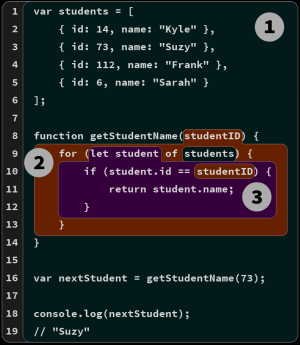

# Chapter 1: What's the Scope.

JS is in fact parsed/compiled in a
separate phase before execution begins. The code author’s
decisions on where to place variables, functions, and blocks
with respect to each other are analyzed according to the rules
of scope, during the initial parsing/compilation phase.

JS functions are themselves first-class values; they can be
assigned and passed around just like numbers or strings. But
since these functions hold and access variables, they maintain
their original scope no matter where in the program the
functions are eventually executed. This is called closure.

# Compiled vs Interpreted

- Compilation is a set of steps that process the text of your code and turn
  it into a list of instructions the computer can understand.

- With interpretation the
  source code is transformed line by line; each line or statement
  is executed before immediately proceeding to processing the
  next line of the source code.

> JS ist most accurately portrayed as a compiled language

# Compiling Code

Scope is primarily determined during compilation.

In classic compiler theory, a program is processed by a com-
piler in three basic stages:

1. Tokenizing/Lexing: breaking up a string of characters
   into meaningful (to the language) chunks, called tokens.

2. Parsing: taking a stream (array) of tokens and turning
   it into a tree of nested elements

3. Code Generation: taking an AST and turning it into ex-
   ecutable code. This part varies greatly depending on the
   language

# Required: Two Phases

processing of JS programs occurs in (at least) two phases:
parsing/compilation first, then execution

There are three program characteristics you can observe to
prove this to yourself: syntax errors, early errors, and hoisting

```js
var greeting = "Hello";
console.log(greeting);
greeting = ."Hi";
// SyntaxError: unexpected token .
```

In fact, the only way the JS engine could know about the
syntax error is by the JS engine first parsing the entire
program before any of it is executed.

```js
Next, consider:
console.log("Howdy");
saySomething("Hello","Hi");
// Uncaught SyntaxError: Duplicate parameter name not
// allowed in this context
function saySomething(greeting,greeting) {
"use strict";
console.log(greeting);
}
```

> The SynthaxError here is thrown before the
> program is executed

# Hoisting

```js
function saySomething() {
	var greeting = 'Hello';
	{
		greeting = 'Howdy'; // error comes from here
		let greeting = 'Hi';
		console.log(greeting);
	}
}
saySomething();
// ReferenceError: Cannot access 'greeting' before
// initialization
```

What’s happening is that
the greeting variable for that statement belongs to the
declaration on the next line, let greeting = "Hi" , rather
than to the previous var greeting = "Hello" statement.

The only way the JS engine could know, at the line where
the error is thrown, that the next statement would declare
a block-scoped variable of the same name

This processing of scopes and declarations can
only accurately be accomplished by parsing the program
before execution.

The ReferenceError here technically comes from greeting
= "Howdy" accessing the greeting variable too early, a con-
flict referred to as the Temporal Dead Zone (TDZ). Chapter 5
will cover this in more detail.

> It’s often asserted that let and const declara-
> tions are not hoisted But this is not accurate

# Compiler Speak

how the JS engine identifies variables and determines the scopes of a
program as it is compiled.

```js
var students = [
	{ id: 14, name: 'Kyle' },
	{ id: 73, name: 'Suzy' },
	{ id: 112, name: 'Frank' },
	{ id: 6, name: 'Sarah' },
];
function getStudentName(studentID) {
	for (let student of students) {
		if (student.id == studentID) {
			return student.name;
		}
	}
}

var nextStudent = getStudentName(73);
console.log(nextStudent);
// Suzy
```

- All occurrences of variables/identi-
  fiers in a program serve in one of two “roles”: either they’re
  the target of an assignment or they’re the source of a value.

How do you know if a variable is a target? Check if there is
a value that is being assigned to it; if so, it’s a target. If not,
then the variable is a source.

# Targets

What makes a variable a target? Consider

```js
students = ['', ''];
```

there are three other target assignment operations in the
code that are perhaps less obvious. One of them:

```js
for (let student of students) {
```

Another target reference

```js
getStudentName(73);
```

And one last

```js
function getStudentName(studentID) {
```

A function declaration is a special case of a target refer-
ence. You can think of it sort of like var getStudentName
= function(studentID) , but that’s not exactly accurate.
An identifier getStudentName is declared (at compile time).

but the = function(studentID) part is also handled at
compilation; the association between getStudentName and
the function is automatically set up at the beginning of the
scope rather than waiting for an = assignment statement to
be executed.

# Sources

In `for (let student of students)` , we said that stu-
dent is a target, but students is a source reference. In the
statement `if (student.id == studentID)` , both student
and studentID are source references. student is also a
source reference in return student.name.

In `getStudentName(73)` , getStudentName is a source reference.
In console.log(nextStudent) , console is a source reference,
as is nextStudent .

> In case you were wondering, id , name , and log
> are all properties, not variable references.

# Cheating: Runtime Scope Modifications

in non-strict-mode, there
are technically still two ways to cheat this rule, modifying
a program’s scopes during runtime.

Neither of these techniques should be used. But it’s important
to be aware of them in case you run across them in some
programs.

The `eval(..)` function receives a string of code to compile
and execute on the fly during the program runtime. If that
string of code has a var or function declaration in it, those
declarations will modify the current scope that the `eval(..)`
is currently executing in:

```js
function badIdea() {
	eval("var oops = 'Ugh!';");
	console.log(oops);
}
badIdea(); // Ugh!
```

`eval(..)` modifies the scope of the `badIdea()` function at runtime.
This is bad for many reasons

```js
var badIdea = { oops: 'Ugh!' };
with (badIdea) {
	console.log(oops);
}
```

The global scope was not modified here, but badIdea was
turned into a scope at runtime rather than compile time, and
its property oops becomes a variable in that scope. Again, this
is a terrible idea, for performance and readability reasons.

> At all costs avoid `eval()` and `with`.

# Lexycal Scope

the key idea of “lexical scope” is that it’s controlled entirely by the
placement of functions, blocks, and variable declarations, in
relation to one another.

If you place a variable declaration inside a function, the
compiler handles this declaration as it’s parsing the function,
and associates that declaration with the function’s scope. If
a variable is block-scope declared `( let / const )`, then it’s
associated with the nearest enclosing { .. } block, rather
than its enclosing function (as with `var` ).

A reference (target or source role)
must be resolved as coming from one of the scopes that
are lexically available to it; otherwise the variable is said
to be “undeclared”

If the variable is not declared in the current scope, the next
outer/enclosing scope will be consulted

- compilation creates a map of all the lexical scopes
  that lays out what the program will need while it executes.

* While scopes are identified during compila-
  tion, they’re not actually created until runtime,

## Chapter 2: Illustrating Lexycal Scope

# Marbles and Buckets, and Bubbles... Oh my!

I see the scope as a landscape with piramyds where you cant access floors above you
but if you are in a superior floor you can descend without any trouble

Every time when a function or for statement is created, a floor is created inside its
brackets you can check

```js
var students = [
	{ id: 14, name: 'Kyle' },
	{ id: 73, name: 'Suzy' },
	{ id: 112, name: 'Frank' },
	{ id: 6, name: 'Sarah' },
];
function getStudentName(studentID) {
	// function scope: BLUE
	for (let student of students) {
		// loop scope: GREEN
		if (student.id == studentID) {
			return student.name;
		}
	}
}
```



The content available in a superior floor can descend, if you are in the
third floor you can desdend to the second floor and pick something
but if you are in the first floor you can ascend
you can only pick things on your current floor

1. Bubble 1 (RED) encompasses the global scope, which
   holds three identifiers/variables: students (line 1), get-
   StudentName (line 8), and nextStudent (line 16).
2. Bubble 2 (BLUE) encompasses the scope of the function
   getStudentName(..) (line 8), which holds just one
   identifier/variable: the parameter studentID (line 8).
3. Bubble 3 (GREEN) encompasses the scope of the for -
   loop (line 9), which holds just one identifier/variable:
   student (line 9).

> Technically, the parameter studentID is not ex-
> actly in the BLUE(2) scope. We’ll unwind that
> confusion in “Implied Scopes” in Appendix A.
> For now, it’s close enough to label studentID a
> BLUE(2) marble.

An expression in the RED(1) bucket only has access to RED(1)
marbles, not BLUE(2) or GREEN(3). An expression in the
BLUE(2) bucket can reference either BLUE(2) or RED(1) mar-
bles, not GREEN(3). And an expression in the GREEN(3)
bucket has access to RED(1), BLUE(2), and GREEN(3) marbles.

- Variables are declared in specific scopes

- Any variable reference that appears in the scope where
  it was declared, or appears in any deeper nested scopes,
  will be labeled a marble of that same color

- The determination of colored buckets, and the marbles
  they contain, happens during compilation

# A Conversation Among Friends

- Engine: responsible for start-to-finish compilation and
  execution of our JavaScript program.

- Compiler: one of Engine’s friends; handles all the dirty
  work of parsing and code-generation (see previous sec-
  tion).

- Scope Manager: another friend of Engine; collects and
  maintains a lookup list of all the declared variables/i-
  dentifiers, and enforces a set of rules as to how these are
  accessible to currently executing code.

```js
var students = [
	{ id: 14, name: 'Kyle' },
	{ id: 73, name: 'Suzy' },
	{ id: 112, name: 'Frank' },
	{ id: 6, name: 'Sarah' },
];
function getStudentName(studentID) {
	for (let student of students) {
		if (student.id == studentID) {
			return student.name;
		}
	}
}
var nextStudent = getStudentName(73);
console.log(nextStudent);
// Suzy
```

We typically think of that as a single statement, but that’s not
how our friend Engine sees it. In fact, JS treats these as two
distinct operations, one which Compiler will handle during
compilation, and the other which Engine will handle during
execution.

The first thing Compiler will do with this program is perform
lexing to break it down into tokens, which it will then parse
into a tree (AST).

1. Encountering var students , Compiler will ask Scope
   Manager to see if a variable named students already
   exists for that particular scope bucket. If so, Compiler
   would ignore this declaration and move on. Otherwise,
   Compiler will produce code that (at execution time) asks
   Scope Manager to create a new variable called students
   in that scope bucket.
2. Compiler then produces code for Engine to later execute,
   to handle the students = [] assignment. The code
   Engine runs will first ask Scope Manager if there is
   a variable called students accessible in the current
   scope bucket. If not, Engine keeps looking elsewhere (see
   “Nested Scope” below). Once Engine finds a variable, it
   assigns the reference of the [ .. ] array to it.

In conversational form

- `Compiler`: Hey, Scope Manager (of the global scope),
  I found a formal declaration for an identifier called
  students , ever heard of it?

- `(Global) Scope Manager`: Nope, never heard of it,
  so I just created it for you.

- `Compiler`: Hey, Scope Manager, I found a formal
  declaration for an identifier called getStudent-
  Name , ever heard of it?

- `(Global) Scope Manager`: Nope, but I just created
  it for you.

- `Compiler`: Hey, Scope Manager, getStudentName
  points to a function, so we need a new scope
  bucket.

- `(Function) Scope Manager`: Got it, here’s the
  scope bucket.

- `Compiler`: Hey, Scope Manager (of the function), I
  found a formal parameter declaration for studen-
  tID , ever heard of it?

- `(Function) Scope Manager`: Nope, but now it’s
  created in this scope.

- `Compiler`: Hey, Scope Manager (of the function),
  I found a for -loop that will need its own scope
  bucket.

The conversation is a question-and-answer exchange, where
Compiler asks the current Scope Manager if an encountered
identifier declaration has already been encountered. If “no,”
Scope Manager creates that variable in that scope. If the
answer is “yes,” then it’s effectively skipped over since there’s
nothing more for that Scope Manager to do.

Later, when it comes to execution of the program, the con-
versation will shift to Engine and Scope Manager, and might
play out like this:

- `Engine`: Hey, Scope Manager (of the global scope),
  before we begin, can you look up the identifier
  getStudentName so I can assign this function to
  it?

- `(Global)` Scope Manager: Yep, here’s the variable.

- `Engine`: Hey, Scope Manager, I found a target
  reference for students , ever heard of it?

- `(Global)` Scope Manager: Yes, it was formally
  declared for this scope, so here it is.

- `Engine`: Thanks, I’m initializing students to un-
  defined , so it’s ready to use.
  Hey, Scope Manager (of the global scope), I found
  a target reference for nextStudent , ever heard of
  it?

- `(Global)` Scope Manager: Yes, it was formally
  declared for this scope, so here it is.

- `Engine`: Thanks, I’m initializing nextStudent to
  undefined , so it’s ready to use.
  Hey, Scope Manager (of the global scope), I found a
  source reference for getStudentName , ever heard
  of it?

- `(Global)` Scope Manager: Yes, it was formally
  declared for this scope. Here it is.

- `Engine`: Great, the value in getStudentName is a
  function, so I’m going to execute it.

- `Engine`: Hey, Scope Manager, now we need to
  instantiate the function’s scope.

To review and summarize how a statement like `var stu dents = [ .. ]` is processed, in two distinct steps:

1. Compiler sets up the declaration of the scope variable
   (since it wasn’t previously declared in the current scope).
2. While Engine is executing, to process the assignment
   part of the statement, Engine asks Scope Manager to look
   up the variable, initializes it to undefined so it’s ready
   to use, and then assigns the array value to it.
