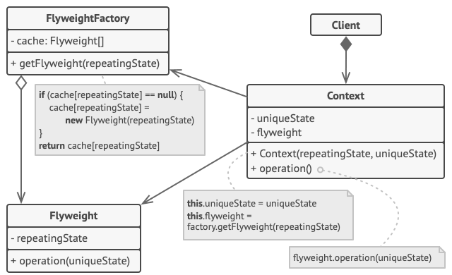

# Fyweight

## Flyweight is a structural design pattern that allows programs to support vast quantities of objects by keeping their memory consumption low.

The pattern achieves it by sharing parts of object state between multiple objects. In other words, the Flyweight saves RAM by caching the same data used by different objects.

---

<b>Usage Examples:</b> The Flyweight pattern has a single purpose: minimizing memory intake. If your program doesn’t struggle with a shortage of RAM, then you might just ignore this pattern for a while.
<b></b> Flyweight can be recognized by a creation method that returns cached objects instead of creating new.

# Problems to solve

> Use the Flyweight pattern only when your program must support a huge number of objects which barely fit into available RAM.
>
> - The benefit of applying the pattern depends heavily on how and where it’s used. It’s most useful when:
> - - an application needs to spawn a huge number of similar objects
> - - this drains all available RAM on a target device
> - - the objects contain duplicate states which can be extracted and shared between multiple objects

# How to implement

This example illustrates the structure of the Flyweight design pattern and focuses on the following questions:

- What classes does it consist of?
- What roles do these classes play?
- In what way the elements of the pattern are related?

1. Divide fields of a class that will become a flyweight into two parts:

   - the intrinsic state: the fields that contain unchanging data duplicated across many objects
   - the extrinsic state: the fields that contain contextual data unique to each object

2. Leave the fields that represent the intrinsic state in the class, but make sure they’re immutable. They should take their initial values only inside the constructor.

3. Go over methods that use fields of the extrinsic state. For each field used in the method, introduce a new parameter and use it instead of the field.

4. Optionally, create a factory class to manage the pool of flyweights. It should check for an existing flyweight before creating a new one. Once the factory is in place, clients must only request flyweights through it. They should describe the desired flyweight by passing its intrinsic state to the factory.

5. The client must store or calculate values of the extrinsic state (context) to be able to call methods of flyweight objects. For the sake of convenience, the extrinsic state along with the flyweight-referencing field may be moved to a separate context class.

> # Pros
>
> - You can save lots of RAM, assuming your program has tons of similar objects.

> # Cons
>
> - You might be trading RAM over CPU cycles when some of the context data needs to be recalculated each time somebody calls a flyweight method.
> - The code becomes much more complicated. New team members will always be wondering why the state of an entity was separated in such a way.
