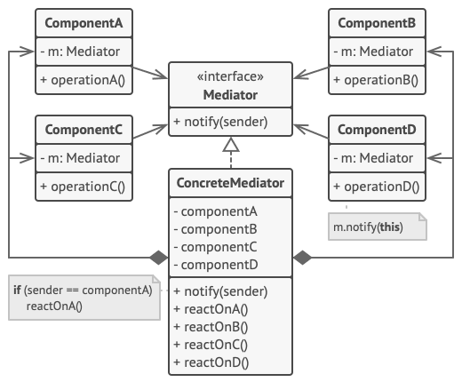

# Mediator

## Mediator is a behavioral design pattern that reduces coupling between components of a program by making them communicate indirectly, through a special mediator object.

The Mediator makes it easy to modify, extend and reuse individual components because
they’re no longer dependent on the dozens of other classes.

---

**Usage examples** The most popular usage of the Mediator pattern in TypeScript code is
facilitating communications between GUI components of an app. The synonym of the Mediator
is the Controller part of MVC pattern.

# Problems to solve

> Use the Mediator pattern when it’s hard to change some of the classes because they are
tightly coupled to a bunch of other classes.
>
> - The pattern lets you extract all the relationships between classes into a separate
class, isolating any changes to a specific component from the rest of the components.

> Use the pattern when you can’t reuse a component in a different program because it’s too
dependent on other components.
>
> - After you apply the Mediator, individual components become unaware of the other
components. They could still communicate with each other, albeit indirectly, through a
mediator object. To reuse a component in a different app, you need to provide it with a
new mediator class.

> Use the Mediator when you find yourself creating tons of component subclasses just to
reuse some basic behavior in various contexts.
>
> - Since all relations between components are contained within the mediator, it’s easy to
define entirely new ways for these components to collaborate by introducing new mediator
classes, without having to change the components themselves.

# How to implement

This example illustrates the structure of the Mediator design pattern and focuses on the
following questions:

- What classes does it consist of?
- What roles do these classes play?
- In what way the elements of the pattern are related?

1. Identify a group of tightly coupled classes which would benefit from being more
independent (e.g., for easier maintenance or simpler reuse of these classes).

2. Declare the mediator interface and describe the desired communication protocol between
mediators and various components. In most cases, a single method for receiving
notifications from components is sufficient.

This interface is crucial when you want to reuse component classes in different contexts.
As long as the component works with its mediator via the generic interface, you can link
the component with a different implementation of the mediator.

3. Implement the concrete mediator class. This class would benefit from storing references
to all of the components it manages.

4. You can go even further and make the mediator responsible for the creation and
destruction of component objects. After this, the mediator may resemble a factory or a
facade.

5. Components should store a reference to the mediator object. The connection is usually
established in the component’s constructor, where a mediator object is passed as an
argument.

6. Change the components’ code so that they call the mediator’s notification method
instead of methods on other components. Extract the code that involves calling other
components into the mediator class. Execute this code whenever the mediator receives
notifications from that component.

> # Pros
>
> - Single Responsibility Principle. You can extract the communications between various
components into a single place, making it easier to comprehend and maintain.
> - Open/Closed Principle. You can introduce new mediators without having to change the
actual components.
> - You can reduce coupling between various components of a program.
> - You can reuse individual components more easily.

> # Cons
>
> - Over time a mediator can evolve into a God Object.
