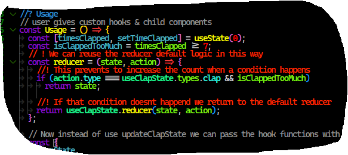

# IMPORTANT

To understand the code writted through the course you need to install the vscode
extension better comments:

https://marketplace.visualstudio.com/items?itemName=aaron-bond.better-comments

This highlights the comments in each file, so the Red comments are comments added during
the current lecture, and default comments are comments added during previous lectures for
example

The comment "user gives custom hooks & child component is from a previous lection
and the comment " ! We can reuse the reducer default logic in this way", is a comment
added in the current file
